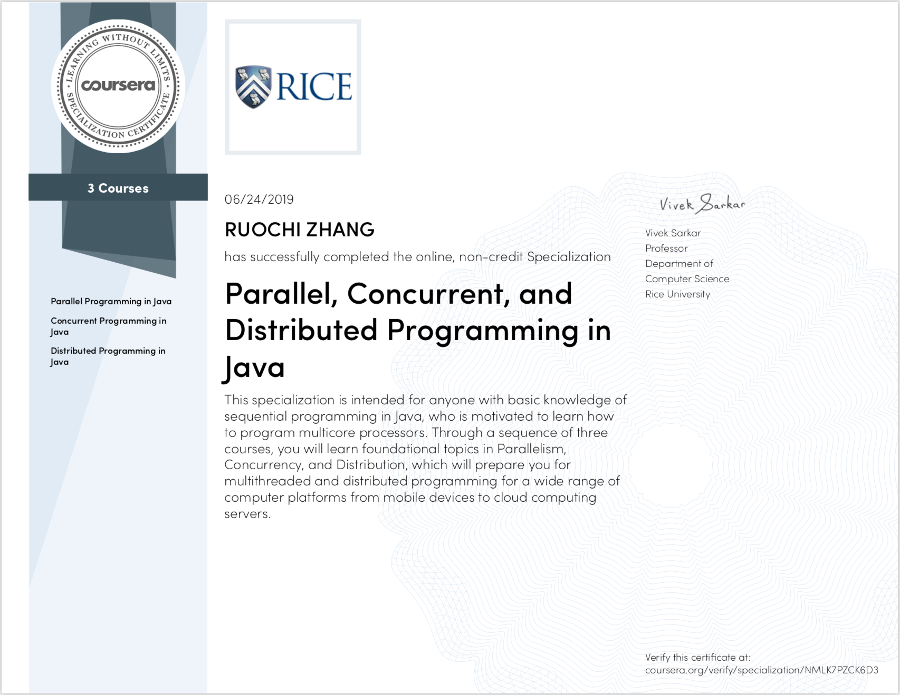
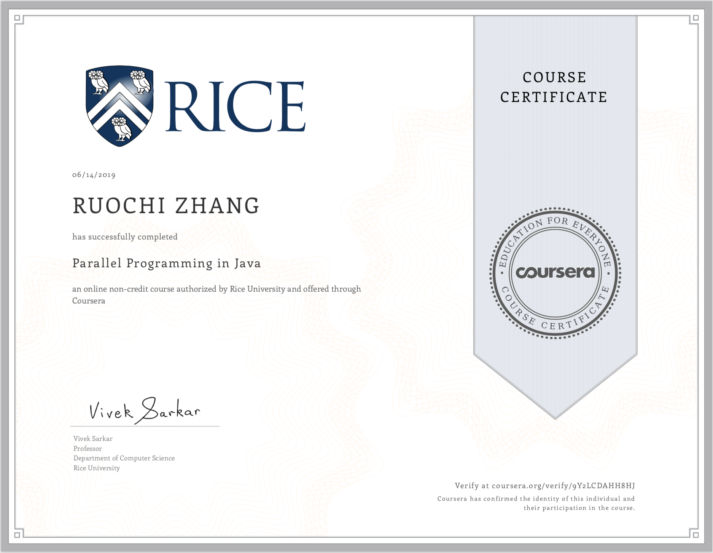
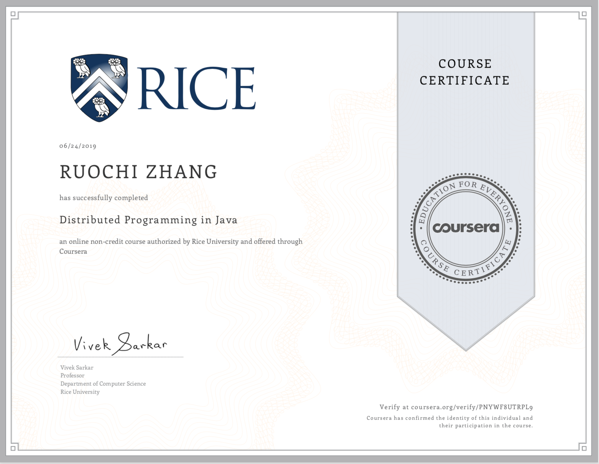

# Parallel, Concurrent, and Distributed Programming in Java Specialization

Parallel, concurrent, and distributed programming underlies software in multiple domains, ranging from biomedical research to financial services. This specialization is intended for anyone with a basic knowledge of sequential programming in Java, who is motivated to learn how to write parallel, concurrent and distributed programs. Through a collection of three courses (which may be taken in any order or separately), you will learn foundational topics in Parallelism, Concurrency, and Distribution. These courses will prepare you for multithreaded and distributed programming for a wide range of computer platforms, from mobile devices to cloud computing servers.

------

# Parallel Programming in Java

**About this Course** This course teaches learners (industry professionals and students) the fundamental concepts of parallel programming in the context of Java 8. Parallel programming enables developers to use multicore computers to make their applications run faster by using multiple processors at the same time. By the end of this course, you will learn how to use popular parallel Java frameworks (such as ForkJoin, Stream, and Phaser) to write parallel programs for a wide range of multicore platforms including servers, desktops, or mobile devices, while also learning about their theoretical foundations including computation graphs, ideal parallelism, parallel speedup, Amdahl's Law, data races, and determinism.

**Why take this course?**

- All computers are multicore computers, so it is important for you to learn how to extend your knowledge of sequential Java programming to multicore parallelism.
- Java 7 and Java 8 have introduced new frameworks for parallelism (ForkJoin, Stream) that have significantly changed the paradigms for parallel programming since the early days of Java.
- Each of the four modules in the course includes an assigned mini-project that will provide you with the necessary hands-on experience to use the concepts learned in the course on your own, after the course ends.
- During the course, you will have online access to the instructor and the mentors to get individualized answers to your questions posted on forums.

**The desired learning outcomes of this course are as follows:**

- Theory of parallelism: computation graphs, work, span, ideal parallelism, parallel speedup, Amdahl's Law, data races, and determinism
- Task parallelism using Java’s ForkJoin framework
- Functional parallelism using Java’s Future and Stream frameworks
- Loop-level parallelism with extensions for barriers and iteration grouping (chunking)
- Dataflow parallelism using the Phaser framework and data-driven tasks

Mastery of these concepts will enable you to immediately apply them in the context of multicore Java programs, and will also provide the foundation for mastering other parallel programming systems that you may encounter in the future  (e.g., C++11, OpenMP, .Net Task Parallel Library).

## Resources
- [Course Resouces](./resources)

## Course One Certificate

## My Course One Notes

### Week1
- Overview
  - Task-level Parallelism
    - Task Creation and Termination (Async, Finish)
    - Creating Tasks in Java's Fork/Join Framework
    - Computation Graphs, Work, Span, Ideal Parallelism
      - Computation Graphs (CGs)
      - ideal parallelism
    - Multiprocessor Scheduling, Parallel Speedup
    - Amdahl’s Law
- [Note](./week1/README.md)
- [Slides](./week1/slides)
- [Projects](./week1/projects)
  - [Project0](./week1/projects/miniproject_0)
  - [README.md](./week1/projects/README.md)
  - [Tutorial-of-concurrent-packages.md](./week1/projects/Tutorial-of-Java-s-concurrent-packages.md)
  - [Project1](./week1/projects/miniproject_1)
- [Attachments](./week1/attachments)

### Week2
- Overview
  - Functional Parallelism
    - Creating Future Tasks in Java’s Fork/Join Framework
    - Memoization
    - Java Streams
    - Determinism and Data Races
      - Determinism
      - Data Races
    - Fork/Join 框架与 Java Stream API
    - Stream的并发实现细节
    - Example
- [Note](./week2/README.md)
- [Slides](./week2/slides)
- [Projects](./week2/projects)
  - [README.md](./week2/projects/README.md)
  - [Project2](./week2/projects/miniproject_2)
- [Attachments](./week2/attachments)

### Week3
- Overview
  - Loop Parallelism
    - Parallel Matrix Multiplication
    - Barriers in Parallel Loops
      - One-Dimensional Iterative Averaging
    - Iteration Grouping: Chunking of Parallel Loops
- [Note](./week3/README.md)
- [Slides](./week3/slides)
- [Projects](./week3/projects)
  - [README.md](./week3/projects/README.md)
  - [Project3](./week3/projects/miniproject_3)
- [Attachments](./week3/attachments)

### Week4
- Overview
  - Split-phase Barriers with Java Phasers
   - Phaser Understanding
  - Point-to-Point Synchronization with Phasers
  - One-Dimensional Iterative Averaging with Phasers
  - Pipeline Parallelism
  - Data Flow Parallelism
- [Note](./week4/README.md)
- [Slides](./week4/slides)
- [Projects](./week4/projects)
  - [README.md](./week4/projects/README.md)
  - [Project4](./week4/projects/miniproject_4)
- [Attachments](./week4/attachments)

# Concurrent Programming in Java

**About this Course** This course teaches learners (industry professionals and students) the fundamental concepts of concurrent programming in the context of Java 8.   Concurrent programming enables developers to efficiently and correctly mediate the use of shared resources in parallel programs.  By the end of this course, you will learn how to use basic concurrency constructs in Java such as threads, locks, critical sections, atomic variables, isolation, actors, optimistic concurrency and concurrent collections, as well as their theoretical foundations (e.g., progress guarantees, deadlock, livelock, starvation, linearizability).

**Why take this course?**

- It is important for you to be aware of the theoretical foundations of concurrency to avoid common but subtle programming errors. 
- Java 8 has modernized many of the concurrency constructs since the early days of threads and locks.
- During the course, you will have online access to the instructor and mentors to get individualized answers to your questions posted on the forums.
- Each of the four modules in the course includes an assigned mini-project that will provide you with the necessary hands-on experience to use the concepts learned in the course on your own, after the course ends.

The desired learning outcomes of this course are as follows:

- Concurrency theory: progress guarantees, deadlock, livelock, starvation, linearizability
- Use of threads and structured/unstructured locks in Java
- Atomic variables and isolation
- Optimistic concurrency and concurrent collections in Java (e.g., concurrent queues, concurrent  hashmaps)
- Actor model in Java

Mastery of these concepts will enable you to immediately apply them in the context of concurrent Java programs, and will also help you master other concurrent programming system that you may encounter in the future  (e.g., POSIX threads, .NET threads).

## Resources
- [Course Resouces](./resources)

## Course Two Certificate

## My Course Two Notes

### Week5
- Overview
  - Threads
  - Structured Locks
  - Unstructured Locks
  - Liveness and Progress Guarantees
    - synchronized 用法
  - Deadlock‘s example
  - Dining Philosophers Problem
- [Note](./week5/README.md)
- [Slides](./week5/slides)
- [Projects](./week5/projects)
  - [README.md](./week5/projects/README.md)
  - [Project5](./week5/projects/miniproject_5)
- [Attachments](./week5/attachments)

### Week6
- Overview
  - Critical Sections
  - Object-Based Isolation
  - Spanning Tree Example
  - Atomic Variables
  - Read-Write Isolation
- [Note](./week6/README.md)
- [Slides](./week6/slides)
- [Projects](./week6/projects)
  - [README.md](./week6/projects/README.md)
  - [Project6](./week6/projects/miniproject_6)
- [Attachments](./week6/attachments)

### Week7
- Overview
  - Actor Model
  - Actor Examples
    - Sieve of Eratosthenes(埃拉托斯特尼筛法)
  - Producer-Consumer Problem with Unbounded Buffer
  - Producer-Consumer Problem with Bounded Buffer
- [Note](./week7/README.md)
- [Slides](./week7/slides)
- [Projects](./week7/projects)
  - [README.md](./week7/projects/README.md)
  - [Project7](./week7/projects/miniproject_7)
- [Attachments](./week7/attachments)

### Week8
- Overview
  - Optimistic Concurrency
  - Concurrent Queue
  - Linearizability
  - Concurrent HashMap
  - Concurrent Minimum Spanning Tree Algorithm
- [Note](./week8/README.md)
- [Slides](./week8/slides)
- [Projects](./week8/projects)
  - [README.md](./week8/projects/README.md)
  - [Project8](./week8/projects/miniproject_8)
- [Attachments](./week8/attachments)

# Distributed Programming in Java

**About this Course** This course teaches learners (industry professionals and students) the fundamental concepts of Distributed Programming in the context of Java 8.  Distributed programming enables developers to use multiple nodes in a data center to increase throughput and/or reduce latency of selected applications.  By the end of this course, you will learn how to use popular distributed programming frameworks for Java programs, including Hadoop, Spark, Sockets, Remote Method Invocation (RMI), Multicast Sockets, Kafka, Message Passing Interface (MPI), as well as different approaches to combine distribution with multithreading.

**Why take this course?**

- All data center servers are organized as collections of distributed servers, and it is important for you to also learn how to use multiple servers for increased bandwidth and reduced latency.
- In addition to learning specific frameworks for distributed programming, this course will teach you how to integrate multicore and distributed parallelism in a unified approach.
- Each of the four modules in the course includes an assigned mini-project that will provide you with the necessary hands-on experience to use the concepts learned in the course on your own, after the course ends.
- During the course, you will have online access to the instructor and the mentors to get individualized answers to your questions posted on forums.

**The desired learning outcomes of this course are as follows**:

- Distributed map-reduce programming in Java using the Hadoop and Spark frameworks
- Client-server programming using Java's Socket and Remote Method Invocation (RMI) interfaces
- Message-passing programming in Java using the Message Passing Interface (MPI)
- Approaches to combine distribution with multithreading, including processes and threads, distributed actors, and reactive programming

Mastery of these concepts will enable you to immediately apply them in the context of distributed Java programs, and will also provide the foundation for mastering other distributed programming frameworks that you may encounter in the future  (e.g., in Scala or C++).

## Resources
- [Course Resouces](./resources)

## Course Three Certificate

## My Course Three Notes

### Week9
- Overview
  - Introduction to MapReduce
  - Apache Hadoop Project
  - Apache Spark Framework
  - TF-IDF Example
  - Page Rank Example
- [Note](./week9/README.md)
- [Slides](./week9/slides)
- [Projects](./week9/projects)
  - [README.md](./week9/projects/README.md)
  - [Project9](./week9/projects/miniproject_9)
- [Attachments](./week9/attachments)

### Week10
- Overview
  - Introduction to Sockets
  - Serialization and Deserialization
  - Remote Method Invocation
    - 远程调用
      - RPC
      - RMI
  - Multicast Sockets
  - Publish-Subscribe Pattern
- [Note](./week10/README.md)
- [Slides](./week10/slides)
- [Projects](./week10/projects)
  - [README.md](./week10/projects/README.md)
  - [Project10](./week10/projects/miniproject_10)
- [Attachments](./week10/attachments)

### Week11
- Overview
  - MPI(Message Passing Interface)
    - MPI的工作方式
    - 点对点通信
    - 群体通信
      - 广播bcast
      - 散播scatter
      - 收集gather
      - 规约reduce
      - 非阻塞标准通信
  - Single Program Multiple Data (SPMD) Model
  - Point-to-Point Communication
  - Message Ordering and Deadlock
  - Non-Blocking Communications
  - Collective Communication
- [Note](./week11/README.md)
- [Slides](./week11/slides)
- [Projects](./week11/projects)
  - [README.md](./week11/projects/README.md)
  - [Project11](./week11/projects/miniproject_11)
- [Attachments](./week11/attachments)

### Week12
- Overview
  - Combining Distribution and Multithreading
  - Multithreaded Servers
  - MPI and Multithreading
  - Distributed Actors
  - Distributed Reactive Programming
- [Note](./week12/README.md)
- [Slides](./week12/slides)
- [Projects](./week12/projects)
  - [README.md](./week12/projects/README.md)
  - [Project12](./week12/projects/miniproject_12)
- [Attachments](./week12/attachments)

