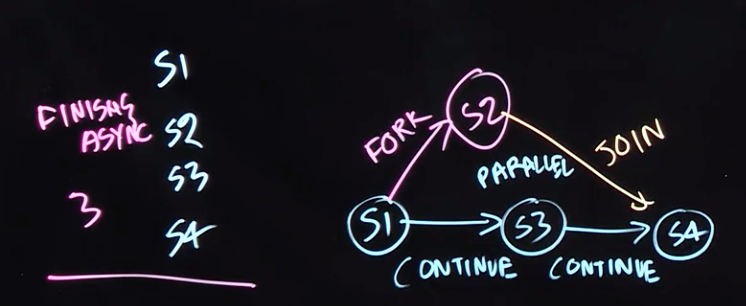
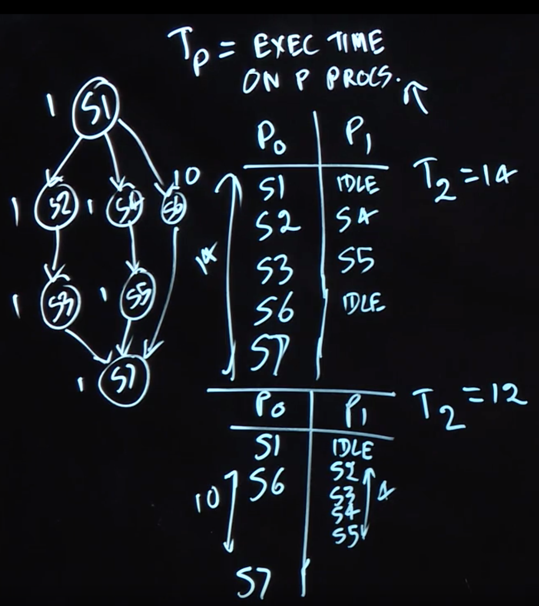

Table of Contents
=================

  * [Task-level Parallelism](#task-level-parallelism)
     * [Task Creation and Termination (Async, Finish)](#task-creation-and-termination-async-finish)
     * [Creating Tasks in Java's Fork/Join Framework](#creating-tasks-in-javas-forkjoin-framework)
     * [Computation Graphs, Work, Span, Ideal Parallelism](#computation-graphs-work-span-ideal-parallelism)
        * [Computation Graphs (CGs)](#computation-graphs-cgs)
        * [ideal parallelism](#ideal-parallelism)
     * [Multiprocessor Scheduling, Parallel Speedup](#multiprocessor-scheduling-parallel-speedup)
     * [Amdahl’s Law](#amdahls-law)


## Task-level Parallelism

### Task Creation and Termination (Async, Finish)
1. **async** notation:  “async ⟨stmt1⟩”, causes the parent task (i.e., the task executing the async statement) to create a new child task to execute the body of the async, ⟨stmt1⟩, asynchronously (i.e., before, after, or in parallel) with the remainder of the parent task.
2. **finish notation**: “finish ⟨stmt2⟩” causes the parent task to execute ⟨stmt2⟩, and then wait until ⟨stmt2⟩ and all async tasks created within ⟨stmt2⟩ have completed
3. Async and finish constructs may be arbitrarily nested.

```
finish {
  async S1; // asynchronously compute sum of the lower half of the array
  S2;       // compute sum of the upper half of the array in parallel with S1
}
S3; // combine the two partial sums after both S1 and S2 have finished
```

### Creating Tasks in Java's Fork/Join Framework

**Fork/Join (FJ) framework**  In this framework, a task can be specified in the 𝚌𝚘𝚖𝚙𝚞𝚝𝚎() method of a user-defined class that extends the standard RecursiveAction class in the FJ framework. 

```Java
private static class ASum extends RecursiveAction {
  int[] A; // input array
  int LO, HI; // subrange
  int SUM; // return value
  . . .
  @Override
  protected void compute() {
    SUM = 0;
    for (int i = LO; i <= HI; i++) SUM += A[i];
  } // compute()
}
```


### Computation Graphs, Work, Span, Ideal Parallelism



#### Computation Graphs (CGs)
**Computation Graphs (CGs)**, which model the execution of a parallel program as a partially ordered set. Specifically, a CG consists of:

- A set of vertices or nodes, in which each node represents a step consisting of an arbitrary sequential computation.
- A set of directed edges that represent ordering constraints among steps.
For fork–join programs, it is useful to partition the edges into three cases:

    1. Continue edges that capture sequencing of steps within a task.
    2. Fork edges that connect a fork operation to the first step of child tasks.
    3. Join edges that connect the last step of a task to all join operations on that task.

CGs can be used to define data races, an important class of bugs in parallel programs. We say that a data race occurs on location L in a computation graph, G, if there exist steps S1 and S2 in G such that there is no path of directed edges from S1 to S2 or from S2 to S1 in G, and both S1 and S2 read or write L (with at least one of the accesses being a write, since two parallel reads do not pose a problem).


#### ideal parallelism

CGs can also be used to reason about the ideal parallelism of a parallel program as follows:

- Define WORK(G) to be the sum of the execution times of all nodes in CG G,
- Define SPAN(G) to be the length of a **longest** path in G, when adding up the execution times of all nodes in the path. The longest paths are known as critical paths, so SPAN also represents the critical path length (CPL) of G.

Given the above definitions of WORK and SPAN, we define the **ideal parallelism** of Computation Graph G as the ratio, **WORK(G)/SPAN(G)**. The ideal parallelism is an upper limit on the speedup factor that can be obtained from parallel execution of nodes in computation graph G. Note that ideal parallelism is only a function of the parallel program, and does not depend on the actual parallelism available in a physical computer.


### Multiprocessor Scheduling, Parallel Speedup

- $T_p$: $T_p$ as the execution time of a CG on P processors
- $T_1$: $T_1$ as the execution time of a CG on 1 processors
- $T_{\infty}$ : $T_{\infty}$ as the execution time of a CG on 1 processors

$$T_{\infty} \leq T_p \leq  T_1$$

We also saw examples for which there could be different values of $T_p$ for different schedules of the same CG on P processors.



**speedup**: given schedule of a CG on P processors as, $ Speedup(P) = \frac{T_1}{T_p} $. Speedup(P) must be $\leq$ the number of processors P , and also $\leq$ the ideal parallelism, WORK/SPAN.


### Amdahl’s Law

q is the fraction of WORK in a parallel program that must be executed sequentially:
$$Speedup(P) \leq \frac{1}{q}$$

