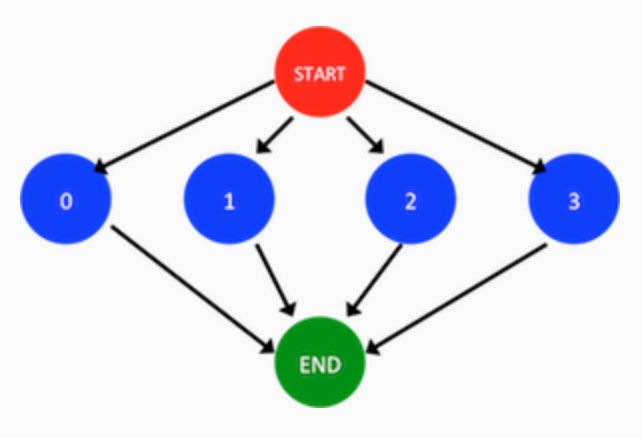

## Project Goals and Outcomes

You have learned how to express parallel algorithms by creating asynchronous tasks (async) , and waiting on collections of tasks (finish). In this mini-project, we will use the Java Fork Join framework to write a parallel implementation of the Reciprocal Array Sum computation. Before starting on this mini-project, it is recommended you review the second demo video in Module 1 in which Professor Sarkar walks through an example similar to this project.

Computing the reciprocal array sum of a vector or array involves adding the reciprocals of all elements of the array. The reciprocal of a value v is simply 1/v. The pseudocode below illustrates how you might sequentially compute the reciprocal sum of an array A:

```
sum = 0
for v in A:
    sum = sum + (1 / v)
    
print ‘The reciprocal array sum of the input array is ‘ + sum
```

It should be clear that the computation of a reciprocal in each iteration of the above for-loop is independent of the reciprocal in any other iteration, and so this problem can be easily parallelized. In particular, the parallel computation graph of this problem can be visualized as follows for a 4-­element array:




where the red circle indicates the start of the parallel program, the green node indicates the end, and the blue nodes each represent an iteration of the for loop.

The goal of this mini-­‐project is to use the Java Fork Join framework to parallelize the provided sequential implementation of Reciprocal Array Sum.


## Project Setup

Please refer to Mini-Project 0 for a description of the build and testing process used in this course.

Once you have downloaded and unzipped the project files using the gray button labeled miniproject_1.zip at the top of this description, you should see the project source code file in

miniproject_1/src/main/java/edu/coursera/parallel/ReciprocalArraySum.java
miniproject_1/src/main/java/edu/coursera/parallel/ReciprocalArraySum.java

and the project tests in

miniproject_1/src/test/java/edu/coursera/parallel/ReciprocalArraySumTest.java
miniproject_1/src/test/java/edu/coursera/parallel/ReciprocalArraySumTest.java

## Project Instructions

Your modifications should be made entirely inside of ReciprocalArraySum.java. You should not change the signatures of any public or protected methods inside of ReciprocalArraySum, but you can edit the method bodies and add any new methods that you choose. We will use our copy of ReciprocalArraySumTest.java in the final grading process, so do not change that file or any other file except ReciprocalArraySum.java.

Your main goals for this assignment are as follows:

1. Modify the ReciprocalArraySum.parArraySum() method to implement the reciprocal-array-sum computation in parallel using the Java Fork Join framework by partitioning the input array in half and computing the reciprocal array sum on the first and second half in parallel, before combining the results. There are TODOs in the source file to guide you, and you are free to refer to the lecture and demonstration videos.

Note that Goal #2 below is a generalization of this goal, so If you are already confident in your understanding of how to partition work among multiple Fork Join tasks (not just two), you are free to skip ahead to Goal #2 below and then implement parArraySum() for Goal #1 by calling the parManyTaskArraySum() method that you will implement for Goal #2 by requesting only two tasks. Otherwise, it is recommended that you work on Goal #1 first, and then proceed to Goal #2.

Note that to complete this and the following goal you will want to explicitly create a ForkJoinPool inside of parArraySum() and parManyTaskArraySum() to run your tasks inside. For example, creating a ForkJoinPool with 2 threads requires the following code:

```Java
import java.util.concurrent.ForkJoinPool;

ForkJoinPool pool = new ForkJoinPool(2);
```


2. Modify the ReciprocalArraySum.parManyTaskArraySum method to implement the reciprocal-array-sum computation in parallel using Java's Fork Join framework again, but using a given number of tasks (not just two). Note that the getChunkStartInclusive and getChunkEndExclusive utility methods are provided for your convenience to help with calculating the region of the input array a certain task should process.

## Project Evaluation

Your assignment submission should consist of only the ReciprocalArraySum.java file that you modified to implement this mini-project. As before, you can upload this file through the assignment page for this mini-project. After that, the Coursera autograder will take over and assess your submission, which includes building your code and running it on one or more tests. Your submission will be evaluated on Coursera’s auto-grading system using 2 and 4 CPU cores. Note that the performance observed for tests on your local machine may differ from that on Coursera's auto-grading system, but that you will only be evaluated on the measured performance on Coursera. Also note that for all assignments in this course you are free to resubmit as many times as you like. See the Common Pitfalls page under Resources for more details. Please give it a few minutes to complete the grading. Once it has completed, you should see a score appear in the “Score” column of the “My submission” tab based on the following rubric:

- 10% - performance of the two-task parallel version on two cores processing 1,000,000 elements
- 20% – performance of the two-task parallel version on two cores processing 100,000,000 elements
- 20% – performance of the many-task parallel version on two cores processing 1,000,000 elements
- 20% – performance of the many-task parallel version on two cores processing 100,000,000 elements
- 30% – performance of the many-task parallel version on four cores processing 100,000,000 elements
