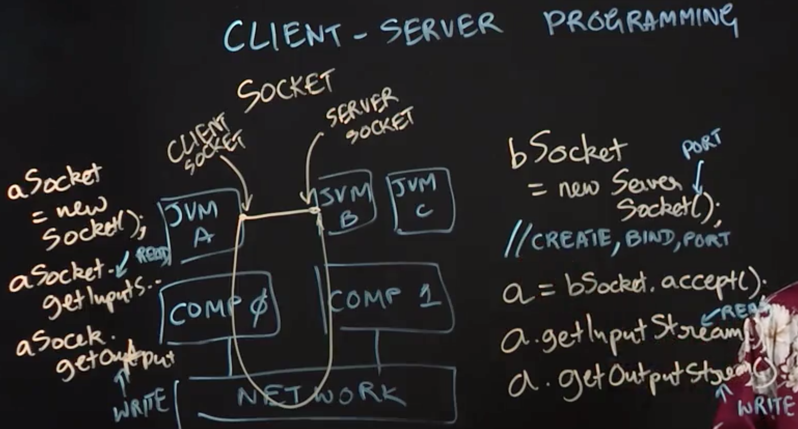
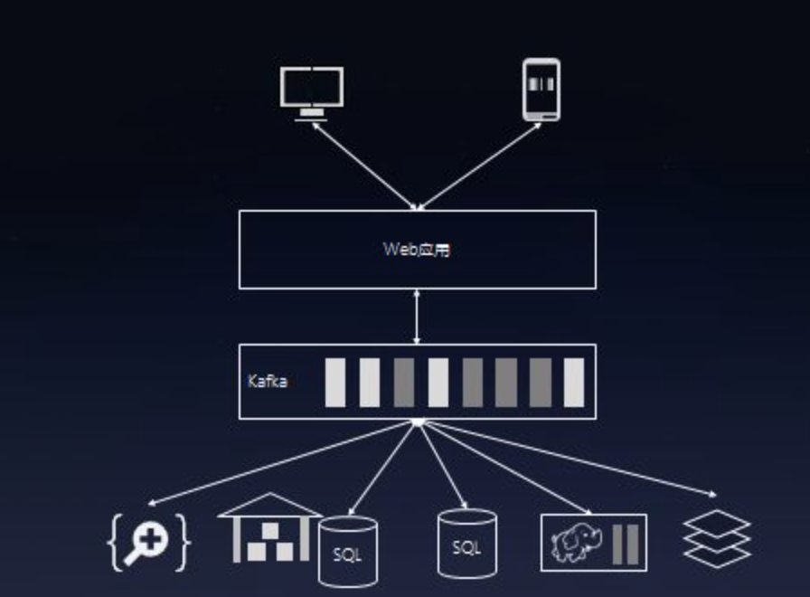

Table of Contents
=================

  * [Introduction to Sockets](#introduction-to-sockets)
  * [Serialization and Deserialization](#serialization-and-deserialization)
  * [Remote Method Invocation](#remote-method-invocation)
     * [远程调用](#远程调用)
        * [RPC](#rpc)
        * [RMI](#rmi)
  * [Multicast Sockets](#multicast-sockets)
  * [Publish-Subscribe Pattern](#publish-subscribe-pattern)
  

## Introduction to Sockets
**Lecture Summary**: In this lecture, we learned about client-server programming, and how two distributed Java applications can communicate with each other using sockets. Since each application in this scenario runs on a distinct Java Virtual Machine (JVM) process, we used the terms "application'', "JVM'' and "process'' interchangeably in the lecture. For JVM A and JVM B to communicate with each other, we assumed that JVM A plays the "client'' role and JVM B the "server'' role. To establish the connection, the main thread in JVM B first creates a ServerSocket  which is initialized with a designated URL and port number. It then waits for client processes to connect to this socket by invoking the socket.accept() method, which returns an object of type Socket. The s.getInputStream() and s.getOutputStream() methods can be invoked on this object to perform read and write operations via the socket, using the same APIs that you use for file I/O via streams.

Once JVM B has set up a server socket, JVM A can connect to it as a client by creating a Socket object with the appropriate parameters to identify JVM B's server port. As in the server case, the getInputStream() and getOutputStream() methods can be invoked on this object to perform read and write operations.  With this setup, JVM A and JVM B can communicate with each other by using read and write operations, which get implemented as messages that flow across the network. Client-server communication occurs at a lower level and scale than MapReduce, which implicitly accomplishes communication among large numbers of processes. Hence, client-server programming is typically used for building distributed applications with small numbers of processes.



## Serialization and Deserialization
**Lecture Summary**: This lecture reviewed serialization and deserialization, which are essential concepts for all forms of data transfers in Java applications, including file I/O and communication in distributed applications. When communications are performed using input and output streams, as discussed in the previous lecture, the unit of data transfer is a sequence of bytes. Thus, it becomes important to serialize objects into bytes in the sender process, and to deserialize bytes into objects in the receiver process.

1. **custom approach**: the programmer provides custom code to perform the serialization and deserialization. However, writing custom serializers and deserializers can become complicated when nested objects are involved, e.g.,if object x contains a field,f3, which points to object y. In this case, the serialization of object x by default also needs to include a serialization of object y. 
2. **XML**: since XML was designed to serve as a data interchange standard. There are many application frameworks that support conversion of application objects into XML objects, which is convenient because typical XML implementations in Java include built-in serializers and deserializers. However, the downside is that there can be a lot of **metadata** created when converting Java objects into XML, and that metadata can add to the size of the serialized data being communicated.
3. **Java Serialization and Deserialization**: This works by identifying classes that implement the Serializable interface, and relying on a guarantee that such classes will have built-in serializers and deserializers, analogous to classes with built-in toString() methods. In this situation, if object x is an instance of a serializable class and its field f3 points to object y,  then object y must also be an instance of a serializable class (otherwise an exception will be thrown when attempting to serialize object x). An important benefit of this approach is that only one copy of each object is included in the serialization, even if there may be multiple references to the object, e.g., if fields f2 and f3  both point to object y. Another benefit is that cycles in object references are handled intelligently, without getting into an infinite loop when following object references. Yet another important benefit is that this approach allows identification of fields that should be skipped during the serialization/deserialization steps because it may be unnecessary and inefficient to include them in the communication. Such fields are identified by declaring them as transient.
4. **Interface Definition Language (IDL)**: A recent example of using the IDL approach can be found in Google's Protocol Buffers framework. A notable benefit of this approach relative to Java serialization is that protocol buffers can support communication of objects across processes implemented in different languages, e.g., Java, C++, Python. The downside is that extra effort is required to enable the serialization (e.g., creating a .proto file as an IDL, and including an extra compile step for the IDL in the build process), which is not required when using Java serialization for communication among Java processes.

## Remote Method Invocation
**Lecture Summary**: This lecture reviewed the concept of Remote Method Invocation (RMI), which extends the notion of method invocation in a sequential program to a distributed programming setting. As an example, let us consider a scenario in which a thread running on JVM A wants to invoke a method, foo(), on object x located on JVM B. This can be accomplished using sockets and messages, but that approach would entail writing a lot of extra code for encoding and decoding the method call, its arguments, and its return value. In contrast, Java RMI provides a very convenient way to directly address this use case.

To enable RMI, we run an RMI client on JVM A and an RMI server on JVM B. Further, JVM A is set up to contain a **stub object** or proxy object for remote object x located on JVM B. (In early Java RMI implementations, a skeleton object would also need to be allocated on the server side, JVM B, as a proxy for the shared object, but this is no longer necessary in modern implementations.) When a stub method is invoked, it transparently initiates a connection with the remote JVM containing the remote object, x, serializes and communicates the method parameters to the remote JVM, receives the result of the method invocation, and deserializes the result into object y(say) which is then passed on to the caller of method x.foo() as the result of the RMI call.

Thus, RMI takes care of a number of tedious details related to remote communication. However, this convenience comes with a few setup requirements as well. First, objects x and y must be serializable, because their values need to be communicated between JVMs A and B, Second, object x must be included in the RMI registry, so that it can be accessed through a global name rather than a local object reference. The registry in turn assists in mapping from global names to references to local stub objects.  In summary, a key advantage of RMI is that, once this setup in place, method invocations across distributed processes can be implemented almost as simply as standard method invocations.

### 远程调用
> src: https://www.jb51.net/article/49436.htm

远程调用使得调用远程服务器的对象、方法的方式就和调用本地对象、方法的方式差不多，因为我们通过网络编程把这些都隐藏起来了。远程调用是分布式系统的基础。

1. 远程过程调用（RPC）
2. 远程方法调用（RMI）

#### RPC
RPC属于函数级别的远程调用，其多是通过HTTP传输数据，数据形式有XML、JSON、序列化数据等。在此，用python做一个xml-rpc的示例。

```Python
## 服务器端server.py
## s是一个绑定了本地8080端口的服务器对象，register_function()方法将函数add注册到s中。serve_forever()启动服务器。
from SimpleXMLRPCServer import SimpleXMLRPCServer   
def add(x, y):
    return x + y    
if __name__ == '__main__':
    s = SimpleXMLRPCServer(('127.0.0.1', 8080))
    s.register_function(add)
    s.serve_forever()

 

## 客户端client.py：
from xmlrpclib import ServerProxy
if __name__ == '__main__':
    s = ServerProxy("http://127.0.0.1:8080")
    print s.add(3,4)
```

我们用wireshark看一下这期间传递的数据是什么样子的。

1. 请求的数据:

```xml
<?xml version='1.0' ?>
<methodCall>
    <methodName>
        add
    </methodName>
    <params>
        <param>
            <value>
                <int> 3 </int>
                </value>
        </param>
        <param>
            <value>
                <int> 4 </int>
            </value>
        </param>
    </params>
</methodCall>
```

2. 响应的数据

```xml
<?xml version='1.0' ?>
<methodResponse>
    <params>
        <param>
            <value>
                <int> 7 </int>
            </value>
        </param>
    </params>
</methodResponse>
```

#### RMI
RMI意为远程方法调用，粒度比RPC要大，因为它的基本单位是对象。其大致思路是这样的：创建RMI服务器对象，将实例化的某个对象以指定的服务名称（也可以是多个对象，但是服务名称不应相同）注册到RMI服务器对象中，之后启动RMI服务器。服务器等待客户端发送的数据（包括服务名称、函数名、参数），将处理结果返回给客户端。 Pyro4是一个基于python的RMI实现，下面我们用Pyro4创建一个RMI服务器，

```Python
## 服务器端 server2.py：
## uri变量是Pyro4用自己的方法为greeting_maker对象生成的uri，其中包括套接字以及为greeting_maker生成的唯一的id。这个id相当于服务名称，当然也可以指定更易懂的服务名称。
import Pyro4
class GreetingMaker(object):
    def get_fortune(self, name):
        return "Hello, {0}. \n" .format(name)
greeting_maker=GreetingMaker()
daemon=Pyro4.Daemon()                
uri=daemon.register(greeting_maker)   
print "Ready. Object uri =", uri      
daemon.requestLoop()

## 客户端 client.py
## 这其中要输入的uri也就是server2.py生成的uri。通过给Pyro4.Proxy传递greeting_maker的uri，可以认为和服务器端的greeting_maker建立的连接，然后调用greeting_maker的get_fortune()方法。
import Pyro4
uri=uri
name="zhang ruochi"
greeting_maker=Pyro4.Proxy(uri)        
print greeting_maker.get_fortune(name)
```


## Multicast Sockets

**Lecture Summary**: In this lecture, we learned about multicast sockets, which are a generalization of the standard socket interface that we studied earlier. Standard sockets can be viewed as unicast communications, in which a message is sent from a source to a single destination. Broadcast communications represent a simple extension to unicast, in which a message can be sent efficiently to all nodes in the same local area network as the sender. In contrast, multicast sockets enable a sender to efficiently send the same message to a specified set of receivers on the Internet. This capability can be very useful for a number of applications, which include news feeds, video conferencing, and multi-player games.  
> One reason why a 1:n multicast socket is more efficient than n 1:1 sockets is because Internet routers have built-in support for the multicast capability.

In recognition of this need, the Java platform includes support for a 𝙼𝚞𝚕𝚝𝚒𝚌𝚊𝚜𝚝𝚂𝚘𝚌𝚔𝚎𝚝 class, which can be used to enable a process to join a group associated with a given 𝙼𝚞𝚕𝚝𝚒𝚌𝚊𝚜𝚝𝚂𝚘𝚌𝚔𝚎𝚝 instance. A member of a group can send a message to all other processes in the group, and can also receive messages sent by other members.This is analogous to how members of a group-chat communicate with each other. Multicast messages are restricted to datagrams, which are usually limited in size to 64KB. Membership in the group can vary dynamically, i.e., processes can decide to join or leave a group associated with a 𝙼𝚞𝚕𝚝𝚒𝚌𝚊𝚜𝚝𝚂𝚘𝚌𝚔𝚎𝚝 instance as they choose. Further, just as with group-chats, a process can be a member of multiple groups.


```Python
## sender.py
import time
import struct
from socket import *

SENDERIP = '192.168.0.116'#本地ip
SENDERPORT = 1501#本地接口
MYPORT = 1234#发送数据到该端口
MYGROUP = '224.1.1.1'#组播组
MYTTL = 255 # 发送数据的TTL值

def sender():
    s = socket(AF_INET, SOCK_DGRAM,IPPROTO_UDP)
    s.bind((SENDERIP,SENDERPORT))
    # Set Time-to-live (optional)
    ttl_bin = struct.pack('@i', MYTTL)
    s.setsockopt(IPPROTO_IP, IP_MULTICAST_TTL, ttl_bin)
    status = s.setsockopt(IPPROTO_IP,
        IP_ADD_MEMBERSHIP,
        inet_aton(MYGROUP) + inet_aton(SENDERIP))#加入到组播组
    while True:
        data = 'cisco'
        s.sendto(data + '\\0', (MYGROUP, MYPORT))
        print "send data ok !"
        time.sleep(10)

if __name__ == "__main__":
    sender()


## receiver.py
import time
import socket

SENDERIP = '192.168.0.116'
MYPORT = 1234
MYGROUP = '224.1.1.1'

def receiver():
    #create a UDP socket
    sock = socket.socket(socket.AF_INET, socket.SOCK_DGRAM, socket.IPPROTO_UDP)
    #allow multiple sockets to use the same PORT number
    sock.setsockopt(socket.SOL_SOCKET,socket.SO_REUSEADDR,1)
    #Bind to the port that we know will receive multicast data
    sock.bind((SENDERIP,MYPORT))
    #tell the kernel that we are a multicast socket
    #sock.setsockopt(socket.IPPROTO_IP, socket.IP_MULTICAST_TTL, 255)
    #Tell the kernel that we want to add ourselves to a multicast group
    #The address for the multicast group is the third param
    status = sock.setsockopt(socket.IPPROTO_IP,
        socket.IP_ADD_MEMBERSHIP,
        socket.inet_aton(MYGROUP) + socket.inet_aton(SENDERIP));

    sock.setblocking(0)
    #ts = time.time()
    while 1:
        try:
            data, addr = sock.recvfrom(1024)
        except socket.error, e:
            pass
        else:
            print "Receive data!"

            print "TIME:" , time.time()
            print "FROM: ", addr
            print "DATA: ", data
if __name__ == "__main__":

    receiver()

# 作者：最后一次被盗 
# 来源：CSDN 
# 原文：https://blog.csdn.net/ztb3214/article/details/19285363 
# 版权声明：本文为博主原创文章，转载请附上博文链接！
```


## Publish-Subscribe Pattern
In this lecture, we studied the publish-subscribe pattern, which represents a further generalization of the multicast concept. In this pattern, publisher processes add messages to designated topics, and subscriber processes receive those messages by registering on the topics that they are interested in. A key advantage of this approach is that publishers need not be aware of which processes are the subscribers, and vice versa. Another advantage is that it lends itself to very efficient implementations because it can enable a number of communication optimizations, which include batching and topic partitioning across broker nodes. Yet another advantage is improved reliability, because broker nodes can replicate messages in a topic, so that if one node hosting a topic fails, the entire publish-subscribe system can continue execution with another node that contains a copy of all messages in that topic.

We also studied how publish-subscribe patterns can be implemented in Java by using APIs available in the open-source Apache Kafka project.  To become a publisher, a process simply needs to create a **KafkaProducer** object, and use it to perform **send()** operations to designated topics. Likewise, to become a consumer, a process needs to create a **KafkaConsumer** object, which can then be used to subscribe to topics of interest. The consumer then performs repeated **poll()** operations, each of which returns a batch of messages from the requested topics. Kafka is commonly used as to produce input for, or receive output from, MapReduce systems such as Hadoop or Spark. By storing Kafka messages as key-value pairs, data analytics applications written using MapReduce programming models can seamlessly interface with Kafka. A common use case for Kafka is to structure messages in a topic to be as key-value pairs, so that they can be conveniently used as inputs to, or outputs from, data analytics applications written in Hadoop or Spark. Each key-value message also generally includes an offset which represents the index of the message in the topic. In summary, publish-subscribe is a higher-level pattern than communicating via sockets, which is both convenient and efficient to use in situations where producers and consumers of information are set up to communicate via message groups (topics).

