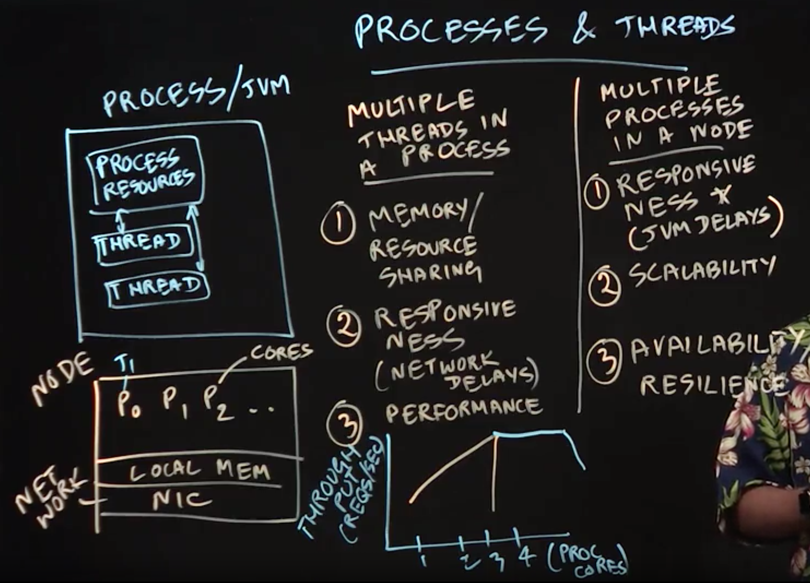

Table of Contents
=================

  * [Combining Distribution and Multithreading](#combining-distribution-and-multithreading)
  * [Multithreaded Servers](#multithreaded-servers)
  * [MPI and Multithreading](#mpi-and-multithreading)
  * [Distributed Actors](#distributed-actors)
  * [Distributed Reactive Programming](#distributed-reactive-programming)

## Combining Distribution and Multithreading

**Lecture Summary**: In this lecture, we introduced processes and threads, which serve as the fundamental building blocks of distributed computing software. 

> example: a process corresponds to a single Java Virtual Machine (JVM) instance, and threads are created within a JVM instance.

1. multiple threads 
- sharing of memory
- improved responsiveness
- improved performance: since threads in the same process can communicate with each other through a shared address space. 

2. multiple processes
- responsiveness: e.g., when a JVM is paused during garbage collection)
- scalability: going past the scalability limitations of multithreading
-  improved resilience: e.g.,JVM failures 

**In summary**: 

1. processes are the basic units of distribution in a cluster of nodes: we can distribute processes across multiple nodes in a data center, and even create multiple processes within a node. 
2. Threads are the basic unit of parallelism and concurrency: we can create multiple threads in a process that can share resources like memory, and contribute to improved performance. However, it is not possible for two threads belonging to the same process to be scheduled on different nodes.



## Multithreaded Servers

**Lecture Summary**: In this lecture, we learned about multithreaded servers as an extension to the servers that we studied in client-server programming. As a motivating example, we studied the timeline for a single request sent to a standard sequential file server, which typically consists of four steps:

```
while True:
    1. accept the request
    2. extract the necessary information from the request
    3. read the file
    4. send the file
```
In practice, step3  is usually the most time-consuming step in this sequence. However, threads can be used to reduce this bottleneck.

```
while True: 
    1. accept the request
    new thread {

    2. extract the necessary information from the request
    3. read the file
    4. send the file 
}
```

In this way, it is possible to process multiple requests simultaneously because they are executing in different threads.

One challenge of following this approach literally is that there is a significant overhead in creating and starting a Java thread. However, since there is usually an upper bound on the number of threads that can be efficiently utilized within a node (often limited by the number of cores or hardware context), it is wasteful to create more threads than that number. There are two approaches that are commonly taken to address this challenge in Java applications.

1. thread pool: threads can be reused across multiple requests instead of creating a new thread for each request.
2.  lightweight tasking (e.g., as in Java's ForkJoin framework) which execute on a thread pool with a bounded number of threads, and offer the advantage that the overhead of task creation is significantly smaller than that of thread creation. 

```Java
class SampleThread extends Thread {
    public int processingCount = 0;
 
    SampleThread(int processingCount) {
        this.processingCount = processingCount;
        LOGGER.info("Thread Created");
    }
 
    @Override
    public void run() {
        LOGGER.info("Thread " + this.getName() + " started");
        while (processingCount > 0) {
            try {
                Thread.sleep(1000);
            } catch (InterruptedException e) {
                LOGGER.info("Thread " + this.getName() + " interrupted");
            }
            processingCount--;
        }
        LOGGER.info("Thread " + this.getName() + " exiting");
    }
}
 
@Test
public void givenStartedThread_whenJoinCalled_waitsTillCompletion() 
  throws InterruptedException {
    Thread t2 = new SampleThread(1);
    t2.start();
    LOGGER.info("Invoking join");
    t2.join();
    LOGGER.info("Returned from join");
    assertFalse(t2.isAlive());
}

// INFO: Thread Created
// INFO: Invoking join
// INFO: Thread Thread-1 started
// INFO: Thread Thread-1 exiting
// INFO: Returned from join
```

## MPI and Multithreading

**Lecture Summary**: In this lecture, we learned how to extend the Message Passing Interface (MPI) with threads. As we learned earlier in the lecture on Processes and Threads, it can be inefficient to create one process per processor core in a multicore node since there is a lot of unnecessary duplication of memory, resources, and overheads when doing so. This same issue arises for MPI programs in which each rank corresponds to a single-threaded process by default. Thus, there are many motivations for creating multiple threads in an MPI process, including the fact that threads can communicate with each other much more efficiently using shared memory, compared with the message-passing that is used to communicate among processes.

One approach to enable multithreading in MPI applications is to create one MPI process (rank) per node, which starts execution in a single thread that is referred to as a master thread. This thread calls MPI_Init() and MPI_Finalize() for its rank, and creates a number of worker threads to assist in the computation to be performed within its MPI process. Further, all MPI calls are performed only by the master thread. This approach is referred to as the 𝙼𝙿𝙸_𝚃𝙷𝚁𝙴𝙰𝙳_𝙵𝚄𝙽𝙽𝙴𝙻𝙴𝙳 mode, since, even though there are multiple threads, all MPI calls are "funneled'' through the master thread. A second more general mode for MPI and multithreading is referred to as 𝙼𝙿𝙸_𝚃𝙷𝚁𝙴𝙰𝙳_SERIALIZED ; in this mode, multiple threads may make MPI calls but must do so one at a time using appropriate concurrency constructs so that the calls are "serialized''. The most general mode is called MPI_THREAD_MULTIPLE because it allows multiple threads to make MPI calls in parallel; though this mode offers more flexibility than the other modes, it puts an additional burden on the MPI implementation which usually gets reflected in larger overheads for MPI calls relative to the more restrictive modes. Further, even the 𝙼𝙿𝙸_𝚃𝙷𝚁𝙴𝙰𝙳_𝙼𝚄𝙻𝚃𝙸𝙿𝙻𝙴 mode has some notable restrictions, e.g., it is not permitted in this mode for two threads in the same process to wait on the same MPI request related to a nonblocking communication.


## Distributed Actors

**Lecture Summary**:

> An actor is an object that has a mailbox, local state, a set of methods and an active (logical) thread of control that can receive one message at a time from the mailbox, invoke a method to perform the work needed by that message, and read and update the local state as needed.

Message-passing in the actor model is nonblocking since the sender and receiver do not need to wait for each other when transmitting messages. The actor paradigm is well suited to both multicore and distributed parallelism, since its message-passing model can be implemented efficiently via shared memory within a single process or in a more distributed manner across multiple processes.

Most actor implementations that support distributed execution require you to perform the following steps.

1. you will need to use some kind of configuration file to specify the host process on which each actor will execute as well as the port that can be used to receive messages from actors on other processes. 
2. you will need the ability to create actors on remote processes.
3. you will need to provide some kind of logical name to refer to a remote actor (since a reference to the actor object can only be used within the process containing that actor).
4. messages transmitted among actors that reside in different processes need to be serialized, as in client-server programming.


## Distributed Reactive Programming
**Lecture Summary**: In this lecture, we studied the reactive programming model and its suitability for implementing distributed service oriented architectures using asynchronous events. A key idea behind this model is to balance the “push'' and “pull'' modes found in different distributed programming models. For example, actors can execute in push mode, since the receiver has no control on how many messages it receives. Likewise, Java streams and Spark RDDs operate in pull mode, since their implementations are demand-driven (lazy). The adoption of distributed reactive programming is on a recent upswing, fueled in part by the availability of the Reactive Streams specification which includes support for multiple programming languages. In the case of Java, the specification consists of four interfaces: 𝙵𝚕𝚘𝚠.𝙿𝚞𝚋𝚕𝚒𝚜𝚑𝚎𝚛, 𝙵𝚕𝚘𝚠.𝚂𝚞𝚋𝚜𝚌𝚛𝚒𝚋𝚎𝚛, 𝙵𝚕𝚘𝚠.𝙿𝚛𝚘𝚌𝚎𝚜𝚜, and 𝙵𝚕𝚘𝚠.𝚂𝚞𝚋𝚜𝚌𝚛𝚒𝚙𝚝𝚒𝚘𝚗.

Conveniently, there is a standard Java implementation of the 𝙵𝚕𝚘𝚠.𝙿𝚞𝚋𝚕𝚒𝚜𝚑𝚎𝚛 interface in the form of the 𝚂𝚞𝚋𝚖𝚒𝚜𝚜𝚒𝚘𝚗𝙿𝚞𝚋𝚕𝚒𝚜𝚑𝚎𝚛 class. If we create an instance of this class called 𝚙𝚞𝚋, a publisher can submit information by calling 𝚙𝚞𝚋.𝚜𝚞𝚋𝚖𝚒𝚝(). Likewise, a subscriber can be registered by calling 𝚙𝚞𝚋.𝚜𝚞𝚋𝚜𝚌𝚛𝚒𝚋𝚎(). Each subscriber has to implement two key methods, 𝚘𝚗𝚂𝚞𝚋𝚜𝚌𝚛𝚒𝚋𝚎() and 𝚘𝚗𝙽𝚎𝚡𝚝(). Both methods allow the subscriber to specify how many elements to request at a time. 

Thus, a key benefit of reactive programming is that the programmer can control the "batching" of information between the publisher and the subscriber to achieve a desired balance between the "push" and "pull" modes.

