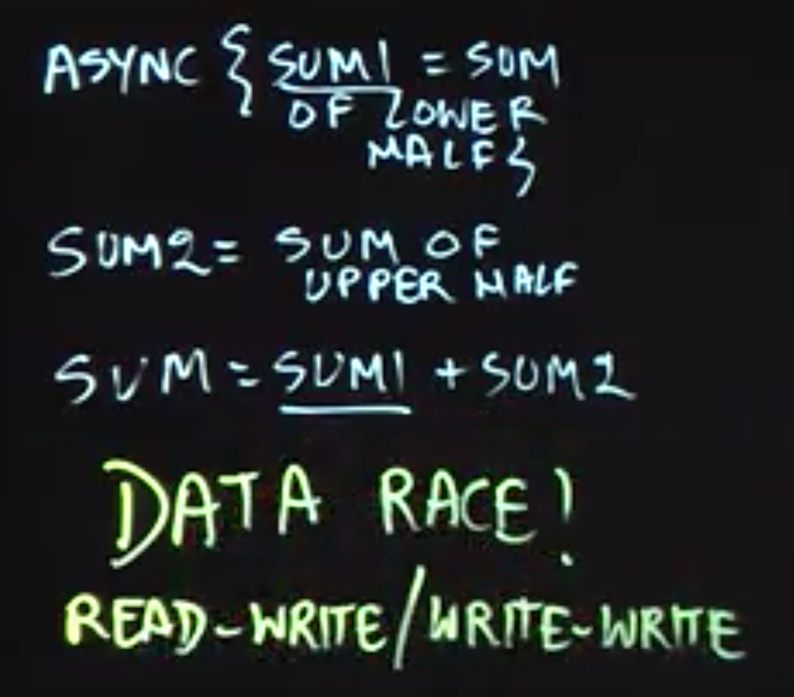
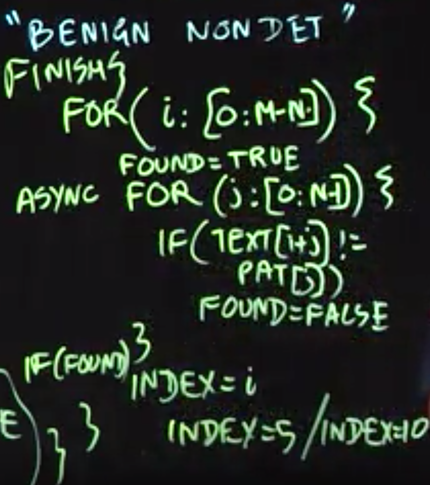

Table of Contents
=================

   * [Functional Parallelism](#functional-parallelism)
      * [Creating Future Tasks in Java’s Fork/Join Framework](#creating-future-tasks-in-javas-forkjoin-framework)
      * [Memoization](#memoization)
      * [Java Streams](#java-streams)
      * [Determinism and Data Races](#determinism-and-data-races)
         * [Determinism](#determinism)
         * [Data Races](#data-races)
      * [Fork/Join 框架与 Java Stream API](#forkjoin-框架与-java-stream-api)
         * [Stream的并发实现细节](#stream的并发实现细节)
         * [Example](#example)
         

# Functional Parallelism

**Future tasks** are tasks with return values
**Future object** is a “handle” for accessing a task’s return value

There are two key operations that can be performed on a future object, A

1. Assignment — A can be assigned a reference to a future object returned by a task of the form, future { ⟨ task-with-return-value ⟩ } (using pseudocode notation). The content of the future object is constrained to be _single assignment_ (similar to a final variable in Java), and cannot be modified after the future task has returned.

2. Blocking read — the operation, A.get(), waits until the task associated with future object A has completed, and then propagates the task’s return value as the value returned by A.get(). Any statement, S, executed after A.get() can be assured that the task associated with future object A must have completed before S starts execution.

## Creating Future Tasks in Java’s Fork/Join Framework
1. A future task extends the **RecursiveTask** class in the FJ framework, instead of RecursiveAction as in regular tasks. (RecursiveTask can have return value)

2. The 𝚌𝚘𝚖𝚙𝚞𝚝𝚎() method of a future task must have a non-void return type, whereas it has a void return type for regular tasks.

3. A method call like 𝚕𝚎𝚏𝚝.𝚓𝚘𝚒𝚗() waits for the task referred to by object 𝚕𝚎𝚏𝚝 in both cases, but also provides the task’s return value in the case of future tasks.

## Memoization
1. Create a data structure that stores the set {($x_1$,$y_1 = f(x_1)$),($x_2$,$y_2 = f(x_2)$),...} for each call $f(x_i)$ that returns $y_i$.
2. Perform look ups in that data structure when processing calls of the form $f(x\prime)$ when $x\prime$ equals one of the $x_i$ inputs for which $f(x_i)$ has already been computed.

Memoization can be especially helpful for algorithms based on dynamic programming. In the lecture, we used Pascal’s triangle as an illustrative example to motivate memoization.

The memoization pattern lends itself easily to parallelization using futures by modifying the memoized data structure to store  {($x_1$,$y_1 = f(x_1)$),($x_2$,$y_2 = f(x_2)$),...}. The lookup operation can then be replaced by a get() operation on the future value, if a future has already been created for the result of a given input.


## Java Streams
the following pipeline can be used to compute the average age of all active students using Java streams:

```Java
students.stream()
    .filter(s -> s.getStatus() == Student.ACTIVE)
    .mapToInt(a -> a.getAge())
    .average();
```

an important benefit of using Java streams when possible is that the pipeline can be made to execute in parallel by designating the source to be a parallel stream, i.e., by simply replacing students.stream() in the above code by students.parallelStream() or Stream.of(students).parallel(). This form of functional parallelism is a major convenience for the programmer, since they **do not** need to worry about explicitly allocating intermediate collections (e.g., a collection of all active students), or about ensuring that parallel accesses to data collections are properly synchronized.


## Determinism and Data Races

### Determinism
A parallel program is said to be:

1. **functionally deterministic** if it always computes the same answer when given the same input.
2. **structurally deterministic** if it always computes the same computation graph, when given the same input.

### Data Races



There may be cases of “benign” nondeterminism for programs with data races in which different executions with the same input may generate different outputs, but all the outputs may be acceptable in the context of the application, e.g., different locations for a search pattern in a target string.



> 转载于 [一字马胡](https://www.jianshu.com/u/86c421886c32)

## Fork/Join 框架与 Java Stream API

Fork/Join框架可以将大的任务切分为足够小的任务，然后将小任务分配给不同的线程来执行，而线程之间通过工作窃取算法来协调资源，提前做完任务的线程可以去“窃取”其他还没有做完任务的线程的任务，而每一个线程都会持有一个双端队列，里面存储着分配给自己的任务，Fork/Join框架在实现上，为了防止线程之间的竞争，线程在消费分配给自己的任务时，是从队列头取任务的，而“窃取”线程则从队列尾部取任务。Fork/Join框架通过fork方法来分割大任务，通过使用join来获取小任务的结果，然后组合成大任务的结果。

### Stream的并发实现细节

Java Stream的操作分为两类，也可以分为三类，具体的细节可以参考该文章：Java Streams API。一个简单的判断一个操作是否是Terminal操作还是Intermediate操作的方法是，如果操作返回的是一个新的Stream，那么就是一个Intermediate操作，否则就是一个Terminal操作。

- **Intermediate**：一个流可以后面跟随零个或多个 intermediate 操作。其目的主要是打开流，做出某种程度的数据操作，然后返回一个新的流，交给下一个操作使用。这类操作都是惰性化的（lazy），就是说，仅仅调用到这类方法，并没有真正开始流的遍历。
- **Terminal**：一个流只能有一个 terminal 操作，当这个操作执行后，流就被使用“光”了，无法再被操作。所以这必定是流的最后一个操作。Terminal 操作的执行，才会真正开始流的遍历，并且会生成一个结果，或者一个 side effect。

Java Stream对四种类型的Terminal操作使用了Fork/Join实现了并发操作，下面的图片展示了这四种操作类型：

- Find
- ForEach
- Match
- Reduce

### Example
```Java
Stream.of(1,2,3,4)
                .parallel()
                .map(n -> n*2)
                .collect(Collectors.toCollection(ArrayList::new));
```

解释一下，上面的代码想要实现的功能是将（1，2，3，4）这四个数字每一个都变为其自身的两倍，然后收集这些元素到一个ArrayList中返回。这是一个非常简单的功能，下面是上面的操作流的执行路径：

```Java
    //step 1:
    
    public static<T> Stream<T> of(T... values) {
        return Arrays.stream(values);
    }
    
    //step 2:
    
    public final <R> Stream<R> map(Function<? super P_OUT, ? extends R> mapper) {
        Objects.requireNonNull(mapper);
        return new StatelessOp<P_OUT, R>(this, StreamShape.REFERENCE,
                                     StreamOpFlag.NOT_SORTED | StreamOpFlag.NOT_DISTINCT) {
            @Override
            Sink<P_OUT> opWrapSink(int flags, Sink<R> sink) {
                return new Sink.ChainedReference<P_OUT, R>(sink) {
                    @Override
                    public void accept(P_OUT u) {
                        downstream.accept(mapper.apply(u));
                    }
                };
            }
        };
    }

    //step 3:
    
        public final <R, A> R collect(Collector<? super P_OUT, A, R> collector) {
            ...
            container = evaluate(ReduceOps.makeRef(collector));
            ...
    }
    
    //step 4:
    
        final <R> R evaluate(TerminalOp<E_OUT, R> terminalOp) {
        assert getOutputShape() == terminalOp.inputShape();
        if (linkedOrConsumed)
            throw new IllegalStateException(MSG_STREAM_LINKED);
        linkedOrConsumed = true;

        return isParallel()
               ? terminalOp.evaluateParallel(this, sourceSpliterator(terminalOp.getOpFlags()))
               : terminalOp.evaluateSequential(this, sourceSpliterator(terminalOp.getOpFlags()));
    }
    
    //step 5:
    
    //使用Fork/Join框架执行操作。
```


上面的五个步骤是经过一些省略的，需要注意的一点是，intermediate类型的操作仅仅将操作加到一个upstream里面，具体的原文描述如下：

> Construct a new Stream by appending a stateless intermediate operation to an existing stream.

比如上面我们的操作中的map操作，实际上只是将操作加到一个intermediate链条上面，不会立刻执行。重点是第五步，Stream是如何使用Fork/Join来实现并发的。evaluate这个方法至关重要，在方法里面会分开处理，对于设置了并发标志的操作流，会使用Fork/Join来并发执行操作任务，而对于没有打开并发标志的操作流，则串行执行操作。
