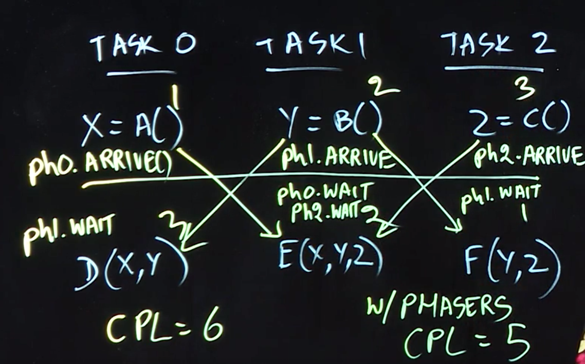
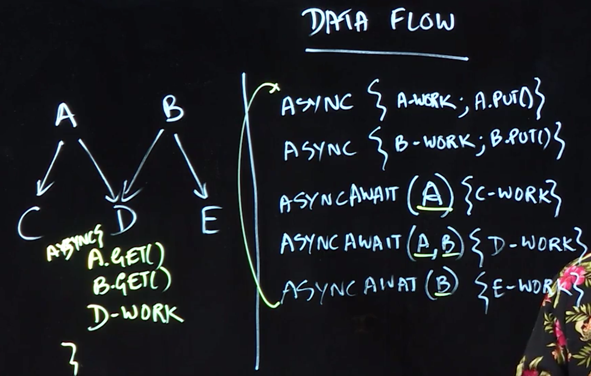

Table of Contents
=================

  * [Split-phase Barriers with Java Phasers](#split-phase-barriers-with-java-phasers)
     * [Phaser Understanding](#phaser-understanding)
  * [Point-to-Point Synchronization with Phasers](#point-to-point-synchronization-with-phasers)
  * [One-Dimensional Iterative Averaging with Phasers](#one-dimensional-iterative-averaging-with-phasers)
  * [Pipeline Parallelism](#pipeline-parallelism)
  * [Data Flow Parallelism](#data-flow-parallelism)


##  Split-phase Barriers with Java Phasers

In this lecture, we examined a variant of the barrier example that we studied earlier:
```Java
forall (i : [0:n-1]) { 
  print HELLO, i;
  myId = lookup(i); // convert int to a string 
  print BYE, myId;
}
```


We learned about Java’s Phaser class, and that the operation **𝚙𝚑.𝚊𝚛𝚛𝚒𝚟𝚎𝙰𝚗𝚍𝙰𝚠𝚊𝚒𝚝𝙰𝚍𝚟𝚊𝚗𝚌𝚎()** can be used to implement a barrier through **phaser object 𝚙𝚑**. We also observed that there are two possible positions for inserting a barrier between the two print statements above — before or after the call to 𝚕𝚘𝚘𝚔𝚞𝚙(𝚒). However, upon closer examination, we can see that the call to 𝚕𝚘𝚘𝚔𝚞𝚙(𝚒) is local to iteration i and that there is no specific need to either complete it before the barrier or to complete it after the barrier. In fact, **the call to 𝚕𝚘𝚘𝚔𝚞𝚙(𝚒) can be performed in parallel with the barrier**. To facilitate this split-phase barrier (also known as a **fuzzy barrier**) we use two separate APIs from Java Phaser class — 𝚙𝚑.𝚊𝚛𝚛𝚒𝚟𝚎() and 𝚙𝚑.𝚊𝚠𝚊𝚒𝚝𝙰𝚍𝚟𝚊𝚗𝚌𝚎(). Together these two APIs form a barrier, but we now have the freedom to insert a computation such as 𝚕𝚘𝚘𝚔𝚞𝚙(𝚒) between the two calls as follows:


```Java

public int arrive()
// Arrives at this phaser, without waiting for others to arrive.
// the arrival phase number, or a negative value if terminated

public int awaitAdvance(int phase)
// Awaits the phase of this phaser to advance from the given phase value, returning immediately if the current phase is not equal to the given phase value or this phaser is terminated.


// initialize phaser ph for use by n tasks ("parties") and initial phase number 0.
Phaser ph = new Phaser(n);
// Create forall loop with n iterations that operate on ph 
forall (i : [0:n-1]) {
  print HELLO, i;
  int phase = ph.arrive();
  
  myId = lookup(i); // convert int to a string

  ph.awaitAdvance(phase);
  print BYE, myId;
}
```

> "party" 是 Phaser 中的一个术语，相当于是线程的意思，当一个 party 到达，就是线程到达意思就是线程到了同步的屏障(Barrier)。


### Phaser Understanding
```Java
import java.util.ArrayList;
import java.util.Date;
import java.util.List;
import java.util.concurrent.Phaser;

public class PhaserExample {

 public static void main(String[] args) throws InterruptedException {

  List<runnable> tasks = new ArrayList<>();

  for (int i = 0; i < 2; i++) {

   Runnable runnable = new Runnable() {
    @Override
    public void run() {
     int a = 0, b = 1;
     for (int i = 0; i < 2000000000; i++) {
      a = a + b;
      b = a - b;
     }
    }
   };

   tasks.add(runnable);

  }

  new PhaserExample().runTasks(tasks);

 }

 void runTasks(List<runnable> tasks) throws InterruptedException {

  // create a Phaser that has one registered party (this means: at this time phaser expects one thread(party) to arrive before it can start the execution cycle) 
  final Phaser phaser = new Phaser(1) {

   // implement the onAdvance-Method to explain that this task list is executed twice (it returns true if phase is equal or higher then 1) 

   // After the threads executed their tasks once they arrive again, the onAdvance-Method is called, now the 2nd cycle is executed

   protected boolean onAdvance(int phase, int registeredParties) {
    return phase >= 1 || registeredParties == 0;
   }
  };

  // iterate over the list of tasks
  for (final Runnable task : tasks) {
   // register this thread with the Phaser. Notice that a Phaser instance does not know the task instances. It's a simple counter of registered, unarrived and arrived parties, shared across participating threads. If two parties are registered then two parties must arrive at the phaser to be able to start the first cycle. 
   phaser.register();

   new Thread() {
    public void run() {
     do {
      // tell the thread to wait at the barrier until the arrived parties equal the registered parties 
      phaser.arriveAndAwaitAdvance();
      task.run();
     } while (!phaser.isTerminated());
    }
   }.start();
   // Just for demonstration purposes, this line delays execution. 
   Thread.sleep(500);
  }
  // deregister one party( main thread). This results in two registered parties and two arrived parties. This causes the threads waiting to execute the first cycle. (in fact the third party arrived while three were registered - but it does not make a difference) 
  phaser.arriveAndDeregister();
 }

}
```

Doing so enables the barrier processing to occur in parallel with the call to 𝚕𝚘𝚘𝚔𝚞𝚙(𝚒), which was our desired outcome.

## Point-to-Point Synchronization with Phasers

In this lecture, we looked at a parallel program example in which the span (critical path length) would be 6 units of time if we used a barrier, but is reduced to 5 units of time if we use individual phasers as shown in the following table:

||||
|:--|:--|:--|
| Task0 |  Task1 | Task2 |
| 1a:X=A();//cost=1  | 1b:Y=B();//cost=2  | 1c:Z=C();//cost=3 |
| 2a:ph0.arrive(); |   2b:ph1.arrive();  |  2c:ph2.arrive(); |
| 3a:ph1.awaitAdvance(0);  | 3b:ph0.awaitAdvance(0); | 3c:ph1.awaitAdvance(0); |
| 4a:D(X,Y);//cost=3 | 4b:ph2.awaitAdvance(0);  | 4c:F(Y,Z);//cost=1 |
|                     | 5b:E(X,Y,Z);//cost=2 |  |  


Each column in the table represents execution of a separate task, and the calls to 𝚊𝚛𝚛𝚒𝚟𝚎() and 𝚊𝚠𝚊𝚒𝚝𝙰𝚍𝚟𝚊𝚗𝚌𝚎(𝟶) represent synchronization across different tasks via phaser objects, 𝚙𝚑𝟶, 𝚙𝚑𝟷, and 𝚙𝚑𝟸, each of which is initialized with a party count of 1 (only one signalling task). (The parameter 0 in 𝚊𝚠𝚊𝚒𝚝𝙰𝚍𝚟𝚊𝚗𝚌𝚎(𝟶) represents a transition from phase 0 to phase 1.)




## One-Dimensional Iterative Averaging with Phasers
In this lecture, we revisited the barrier-based Iterative Averaging example that we studied earlier, and observed that a full barrier is not necessary since forall iteration i only needs to wait for iterations i − 1 and i + 1 to complete their current phase before iteration i can move to its next phase. This idea can be captured by phasers, if we allocate an array of phasers as follows:

```Java
// Allocate array of phasers
Phaser[] ph = new Phaser[n+2]; //array of phasers
for (int i = 0; i < ph.length; i++) 
  ph[i] = new Phaser(1);

// Main computation 
forall ( i: [1:n-1]) {
  for (iter: [0:nsteps-1]) {
    newX[i] = (oldX[i-1] + oldX[i+1]) / 2;
    ph[i].arrive();
    
    if (index > 1) ph[i-1].awaitAdvance(iter);
    if (index < n-1) ph[i + 1].awaitAdvance(iter); 
    swap pointers newX and oldX;
  }
}
```


As we learned earlier, grouping/chunking of parallel iterations in a forall can be an important consideration for performance (due to reduced overhead). The idea of grouping of parallel iterations can be extended to forall loops with phasers as follows:

```Java
// Allocate array of phasers proportional to number of chunked tasks 
Phaser[] ph = new Phaser[tasks+2]; //array of phasers
for (int i = 0; i < ph.length; i++) ph[i] = new Phaser(1);

// Main computation 
forall ( i: [0:tasks-1]) {
  for (iter: [0:nsteps-1]) {
    // Compute leftmost boundary element for group
    int left = i * (n / tasks) + 1;
    myNew[left] = (myVal[left - 1] + myVal[left + 1]) / 2.0;
    
    // Compute rightmost boundary element for group 
    int right = (i + 1) * (n / tasks);
    myNew[right] = (myVal[right - 1] + myVal[right + 1]) / 2.0;
    
    // Signal arrival on phaser ph AND LEFT AND RIGHT ELEMENTS ARE AV 
    int index = i + 1;
    ph[index].arrive();
    
    // Compute interior elements in parallel with barrier 
    for (int j = left + 1; j <= right - 1; j++)
      myNew[j] = (myVal[j - 1] + myVal[j + 1]) / 2.0;
    // Wait for previous phase to complete before advancing 
    if (index > 1) ph[index - 1].awaitAdvance(iter);
    if (index < tasks) ph[index + 1].awaitAdvance(iter);
    swap pointers newX and oldX;
  }
}
```


## Pipeline Parallelism

In this lecture, we studied how point-to-point synchronization can be used to build a one-dimensional pipeline with p tasks (stages), T0,...Tn. For example, three important stages in a medical imaging pipeline are denoising, registration, and segmentation.

We performed a simplified analysis of the WORK and SPAN for pipeline parallelism as follows.
Let n be the number of input items and p the number of stages in the pipeline, WORK = n × p is the total work that must be done for all data items, and CPL = n + p − 1 is the span or critical path length for the pipeline. Thus, the ideal parallelism is PAR = WORK /CPL = np / (n + p − 1). This formula can be validated by considering a few boundary cases. When p = 1, the ideal parallelism degenerates to PAR = 1, which confirms that the computation is sequential when only one stage is available. Likewise, when n = 1, the ideal parallelism again degenerates to PAR = 1, which confirms that the computation is sequential when only one data item is available. When n is much larger than p (n » p), then the ideal parallelism approaches PAR = p in the limit, which is the best possible case.

The synchronization required for pipeline parallelism can be implemented using phasers by allocating an array of phasers, such that phaser 𝚙𝚑[𝚒] is “signalled” in iteration i by a call to 𝚙𝚑[𝚒].𝚊𝚛𝚛𝚒𝚟𝚎() as follows:

```Java
// Code for pipeline stage i
while ( there is an input to be processed ) {
  // wait for previous stage, if any 
  if (i > 0) 
    ph[i - 1].awaitAdvance(); 

  process input;
  
  // signal next stage
  ph[i].arrive();
}
```

## Data Flow Parallelism

Thus far, we have studied computation graphs as structures that are derived from parallel programs. In this lecture, we studied a dual approach advocated in the data flow parallelism model, which is to specify parallel programs as computation graphs. The simple data flow graph studied in the lecture consisted of five nodes and four edges: A → C, A → D, B → D, B → E. While futures can be used to generate such a computation graph, e.g., by including calls to A.get() and B.get() in task D, the computation graph edges are implicit in the get() calls when using futures. Instead, we introduced the asyncAwait notation to specify a task along with an explicit set of preconditions (events that the task must wait for before it can start execution). With this approach, the program can be generated directly from the computation graph as follows:




```Java
async( () -> {/* Task A */; A.put(); } ); // Complete task and trigger event A
async( () -> {/* Task B */; B.put(); } ); // Complete task and trigger event B
asyncAwait(A, () -> {/* Task C */} );       // Only execute task after event A is triggered 
asyncAwait(A, B, () -> {/* Task D */} );      // Only execute task after events A, B are triggered 
asyncAwait(B, () -> {/* Task E */} );       // Only execute task after event B is triggered
```


Interestingly, the order of the above statements is not significant. Just as a graph can be defined by enumerating its edges in any order, the above data flow program can be rewritten as follows, without changing its meaning:

```Java
asyncAwait(A, () -> {/* Task C */} );       // Only execute task after event A is triggered 
asyncAwait(A, B, () -> {/* Task D */} );      // Only execute task after events A, B are triggered 
asyncAwait(B, () -> {/* Task E */} );       // Only execute task after event B is triggered 
async( () -> {/* Task A */; A.put(); } ); // Complete task and trigger event A
async( () -> {/* Task B */; B.put(); } ); // Complete task and trigger event B
```

Finally, we observed that the power and elegance of data flow parallel programming is accompanied by the possibility of a lack of progress that can be viewed as a form of “deadlock” if the program omits a put() call for signalling an event.


