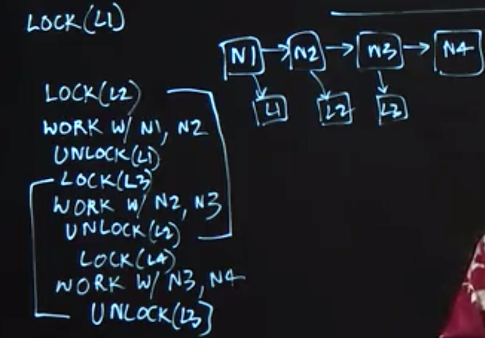
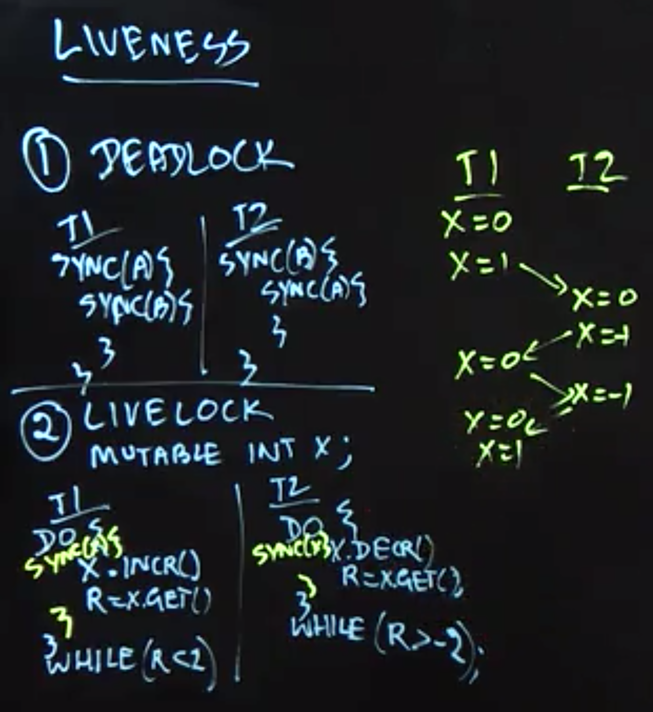

Table of Contents
=================

  * [Threads](#threads)
  * [Structured Locks](#structured-locks)
  * [Unstructured Locks](#unstructured-locks)
  * [Liveness and Progress Guarantees](#liveness-and-progress-guarantees)
     * [synchronized 用法](#synchronized-用法)
  * [Deadlock‘s example](#deadlocks-example)
  * [Dining Philosophers Problem](#dining-philosophers-problem)


## Threads

> Now, threads have been around for over five decades and they are the assembly language of parallel execution. Every operating system supports threads in one form or the other. And the way they work right under the hood is that if you have a multicore processor and I'll just show two processors, P0, P1, you have the ability to create units of execution called threads, T1, T2, T3. And the operating system takes care of scheduling these threads on processors as they're available.

When an instance of 𝚃𝚑𝚛𝚎𝚊𝚍 is **created** (via a 𝚗𝚎𝚠 operation), it does not start executing right away; instead, it can only start executing when its **𝚜𝚝𝚊𝚛𝚝()** method is invoked. The statement or computation to be executed by the thread is specified as a parameter to the constructor.

The Thread class also includes a wait operation in the form of a 𝚓𝚘𝚒𝚗() method. If thread 𝚝𝟶 performs a 𝚝𝟷.𝚓𝚘𝚒𝚗() call, thread 𝚝𝟶 will be forced to wait until thread 𝚝𝟷 completes, after which point it can safely access any values computed by thread 𝚝𝟷. Since there is no restriction on which thread can perform a 𝚓𝚘𝚒𝚗 on which other thread, it is possible for a programmer to erroneously create a deadlock cycle with 𝚓𝚘𝚒𝚗 operations. (A deadlock occurs when two threads wait for each other indefinitely, so that neither can make any progress.)


## Structured Locks

- To enforce mutual exclusion and avoid data races
- Can be implemented using 𝚜𝚢𝚗𝚌𝚑𝚛𝚘𝚗𝚒𝚣𝚎𝚍 statements and methods in Java
>  their acquire and release operations are implicit, since these operations are automatically performed by the Java runtime environment when entering and exiting the scope of a 𝚜𝚢𝚗𝚌𝚑𝚛𝚘𝚗𝚒𝚣𝚎𝚍 statement or method, even if an exception is thrown in the middle.

- W𝚊𝚒𝚝() and N𝚘𝚝𝚒𝚏𝚢() operations that can be used to block and resume threads that need to wait for specific conditions.
- Structured locks are also referred to as intrinsic locks or monitors.


## Unstructured Locks

In this lecture, we introduced unstructured locks (which can be obtained in Java by creating instances of 𝚁𝚎𝚎𝚗𝚝𝚛𝚊𝚗𝚝𝙻𝚘𝚌𝚔()), and used three examples to demonstrate their generality relative to structured locks. 

1. Explicit 𝚕𝚘𝚌𝚔() and 𝚞𝚗𝚕𝚘𝚌𝚔(), support a hand-over-hand locking pattern that implements a non-nested pairing of lock/unlock operations which cannot be achieved with synchronized statements/methods.
2. 𝚝𝚛𝚢𝙻𝚘𝚌𝚔() operations in unstructured locks can enable a thread to check the availability of a lock, and thereby acquire it if it is available or do something else if it is not.
3. read-write locks (which can be obtained in Java by creating instances of 𝚁𝚎𝚎𝚗𝚝𝚛𝚊𝚗𝚝𝚁𝚎𝚊𝚍𝚆𝚛𝚒𝚝𝚎𝙻𝚘𝚌𝚔()), whereby multiple threads are permitted to acquire a lock 𝙻 in “read mode”, 𝙻.𝚛𝚎𝚊𝚍𝙻𝚘𝚌𝚔().𝚕𝚘𝚌𝚔(), but only one thread is permitted to acquire the lock in “write mode”, 𝙻.𝚠𝚛𝚒𝚝𝚎𝙻𝚘𝚌𝚔().𝚕𝚘𝚌𝚔().

**However, it is also important to remember that the generality and power of unstructured locks is accompanied by an extra responsibility on the part of the programmer, e.g., ensuring that calls to 𝚞𝚗𝚕𝚘𝚌𝚔() are not forgotten, even in the presence of exceptions.**



## Liveness and Progress Guarantees

There are three ways in which a parallel program may enter a state in which it stops making forward progress. For sequential programs, an “infinite loop” is a common way for a program to stop making forward progress, but there are other ways to obtain an absence of progress in a parallel program.

1. **Deadlock**: all threads are blocked indefinitely, thereby preventing any forward progress.
2. **Livelock**: all threads repeatedly perform an interaction that prevents forward progress, e.g., an infinite “loop” of repeating lock acquire/release patterns. 
3. **starvation**: at least one thread is prevented from making any forward progress.

The term “liveness” refers to a progress guarantee. The three progress guarantees that correspond to the absence of the conditions listed above are deadlock freedom, livelock freedom, and starvation freedom.




### synchronized 用法

```Java

// --------------------- 
// 作者：叉叉哥 
// 来源：CSDN 
// 原文：https://blog.csdn.net/xiao__gui/article/details/8188833 
// 版权声明：本文为博主原创文章，转载请附上博文链接！


class Sync {
 
    public synchronized void test() {
        System.out.println("test开始..");
        try {
            Thread.sleep(1000);
        } catch (InterruptedException e) {
            e.printStackTrace();
        }
        System.out.println("test结束..");
    }
}
 
class MyThread extends Thread {
 
    public void run() {
        Sync sync = new Sync();
        sync.test();
    }
}
 
public class Main {
 
    public static void main(String[] args) {
        for (int i = 0; i < 3; i++) {
            Thread thread = new MyThread();
            thread.start();
        }
    }
}

// 运行结果：
// test开始..
// test开始..
// test开始..
// test结束..
// test结束..
// test结束..
```

上面的程序起了三个线程，同时运行Sync类中的test()方法，虽然test()方法加上了synchronized，但是还是同时运行起来，synchronized没起作用。 


```Java
public void test() {
    synchronized(this){
        System.out.println("test开始..");
        try {
            Thread.sleep(1000);
        } catch (InterruptedException e) {
            e.printStackTrace();
        }
        System.out.println("test结束..");
    }
}

// 运行结果：
// test开始..
// test开始..
// test开始..
// test结束..
// test结束..
// test结束..
```

没有看到synchronized起到作用。 


```Java
class MyThread extends Thread {
 
    private Sync sync;
 
    public MyThread(Sync sync) {
        this.sync = sync;
    }
 
    public void run() {
        sync.test();
    }
}
 
public class Main {
 
    public static void main(String[] args) {
        Sync sync = new Sync();
        for (int i = 0; i < 3; i++) {
            Thread thread = new MyThread(sync);
            thread.start();
        }
    }
}

// 运行结果：
// test开始..
// test结束..
// test开始..
// test结束..
// test开始..
// test结束..
```

此时的synchronized就起了作用。


因此，**synchronized锁住的是括号里的对象，而不是代码**。对于非static的synchronized方法，锁的就是对象本身也就是this。当synchronized锁住一个对象后，别的线程如果也想拿到这个对象的锁，就必须等待这个线程执行完成释放锁，才能再次给对象加锁，这样才达到线程同步的目的。即使两个不同的代码段，都要锁同一个对象，那么这两个代码段也不能在多线程环境下同时运行。所以我们在用synchronized关键字的时候，能缩小代码段的范围就尽量缩小，能在代码段上加同步就不要再整个方法上加同步。这叫减小锁的粒度，使代码更大程度的并发。原因是基于以上的思想，锁的代码段太长了，别的线程是不是要等很久，等的花儿都谢了。当然这段是题外话，与本文核心思想并无太大关联。


## Deadlock‘s example

```Java

// Alphonse and Gaston are friends, and great believers in courtesy. A strict rule of courtesy is that when you bow to a friend, you must remain bowed until your friend has a chance to return the bow. Unfortunately, this rule does not account for the possibility that two friends might bow to each other at the same time. This example application, Deadlock, models this possibility

// When Deadlock runs, it's extremely likely that both threads will block when they attempt to invoke bowBack. Neither block will ever end, because each thread is waiting for the other to exit bow.


public class Deadlock {
    static class Friend {
        private final String name;
        public Friend(String name) {
            this.name = name;
        }
        public String getName() {
            return this.name;
        }
        public synchronized void bow(Friend bower) {
            System.out.format("%s: %s"
                + "  has bowed to me!%n", 
                this.name, bower.getName());
            bower.bowBack(this);
        }
        public synchronized void bowBack(Friend bower) {
            System.out.format("%s: %s"
                + " has bowed back to me!%n",
                this.name, bower.getName());
        }
    }

    public static void main(String[] args) {
        final Friend alphonse =
            new Friend("Alphonse");
        final Friend gaston =
            new Friend("Gaston");
        new Thread(new Runnable() {
            public void run() { alphonse.bow(gaston); }
        }).start();
        new Thread(new Runnable() {
            public void run() { gaston.bow(alphonse); }
        }).start();
    }
}
```

## Dining Philosophers Problem

In this lecture, we studied a classical concurrent programming example that is referred to as the Dining Philosophers Problem. In this problem, there are five threads, each of which models a “philosopher” that repeatedly performs a sequence of actions which include think, pick up chopsticks, eat, and put down chopsticks.

First, we examined a solution to this problem using structured locks, and demonstrated how this solution could lead to a deadlock scenario (but not livelock). Second, we examined a solution using unstructured locks with 𝚝𝚛𝚢𝙻𝚘𝚌𝚔() and 𝚞𝚗𝚕𝚘𝚌𝚔() operations that never block, and demonstrated how this solution could lead to a livelock scenario (but not deadlock). Finally, we observed how a simple modification to the first solution with structured locks, in which one philosopher picks up their right chopstick and their left, while the others pick up their left chopstick first and then their right, can guarantee an absence of deadlock.

> --------------------- 
> 作者：九茶 
> 来源：CSDN 
> 原文：https://blog.csdn.net/Bone_ACE/article/details/46362599 
> 版权声明：本文为博主原创文章，转载请附上博文链接！


五个哲学家（A\~E）围着一张圆桌就餐，他们每个人面前都有一盘通心粉。由于通心粉很滑，所以需要两只筷子才能夹住，但每两个盘子之间只放着一只筷子，如下图。 
哲学家只有两个动作：要么就餐，要么思考。而且他们之间从不交谈。 
当一个哲学家饿了的时候，就拿起盘子左右两边的筷子开始就餐（不能同时拿起两只筷子）。就餐完以后，就把筷子放回盘子左右，继续思考。 


由于他们之间互不交谈，所以很容易出现“死锁”：假如每个人都拿着左边的筷子，则所有人都在等右边的筷子，谁都吃不了。 
我们可以规定，拿着一只筷子等待另一只筷子的时间超过五分钟就放下手中的筷子，并且再等待五分钟之后进行下一次尝试。 
这个策略消除了死锁，不过还是有可能发生“活锁”：假如这五个人同时拿起左边的筷子，大家都在等另一只筷子，五分钟之后大家同时放下筷子。再过五分钟之后又同时拿起左边的筷子……

在计算机领域中，哲学家就餐问题可以抽象成资源抢占问题，筷子就是“资源”。一种常用的计算机技术就是给资源“加锁”，一个资源同时只能供一个程序或者一段代码访问。当一个程序要使用的资源被另外一个程序锁定的时候，只能等待资源被解锁。这就容易出现死锁情况，当有两个程序需要访问两个相同的资源时，如果每个程序都锁了一个资源，那么两者都在等待对方解锁另一个资源的解锁，最后谁都无法执行。

以下介绍三种解决方案。

1. **服务生**: 对于就餐问题，我们可以引入一个服务生，哲学家要经过服务生同意才能拿筷子，因为服务生知道哪只筷子在使用，他可以阻止死锁的发生。 
这很好理解，只有当盘子左右的筷子都空闲的时候，服务生才会同意哲学家就餐，这样就不存在有人拿着一只筷子在等待另一只筷子的情况，也就杜绝了死锁的发生。 

2. **资源分级**: 另外一种方法就是给资源分级，例如上图中的五只筷子，给它们分级为1\~5五个等级。 
约定：每位哲学家在就餐拿筷子的时候，只能先拿级别比较低的筷子，然后才能拿级别比较高的。用餐完以后，先放下级别比较高的筷子，再放下编号比较低的。这样也不会出现死锁的情况。假如大家同时拿起一只筷子，那么级别最高的5号筷子一定还留在桌子上。此时哲学家A或者E就能拿起它凑成两只筷子开始进餐。进餐完以后放下筷子，其他哲学家又能进餐了。但是仍然有starvation的情况。

```Java
package edu.coursera.concurrent;

import java.util.concurrent.locks.ReentrantLock;
import java.util.concurrent.locks.ReentrantReadWriteLock;

/**
 * Wrapper class for two lock-based concurrent list implementations.
 */
public final class CoarseLists {
    /**
     * An implementation of the ListSet interface that uses Java locks to
     * protect against concurrent accesses.
     *
     * TODO Implement the add, remove, and contains methods below to support
     * correct, concurrent access to this list. Use a Java ReentrantLock object
     * to protect against those concurrent accesses. You may refer to
     * SyncList.java for help understanding the list management logic, and for
     * guidance in understanding where to place lock-based synchronization.
     */
    public static final class CoarseList extends ListSet {
        /*
         * TODO Declare a lock for this class to be used in implementing the
         * concurrent add, remove, and contains methods below.
         */
         private final ReentrantLock lock = new  ReentrantLock();


        /**
         * Default constructor.
         */
        public CoarseList() {
            super();
        }

        /**
         * {@inheritDoc}
         *
         * TODO Use a lock to protect against concurrent access.
         */
        @Override
        boolean add(final Integer object) {

            try {
                lock.lock();
                Entry pred = this.head;
                Entry curr = pred.next;

                while (curr.object.compareTo(object) < 0) {
                    pred = curr;
                    curr = curr.next;
                }

                if (object.equals(curr.object)) {
                    return false;
                } else {
                    final Entry entry = new Entry(object);
                    entry.next = curr;
                    pred.next = entry;
                    return true;
                }
            } finally {
                lock.unlock();
            }
        }

        /**
         * {@inheritDoc}
         *
         * TODO Use a lock to protect against concurrent access.
         */
        @Override
        boolean remove(final Integer object) {
            try {
                lock.lock();
                Entry pred = this.head;
                Entry curr = pred.next;

                while (curr.object.compareTo(object) < 0) {
                    pred = curr;
                    curr = curr.next;
                }

                if (object.equals(curr.object)) {
                    pred.next = curr.next;
                    return true;
                } else {
                    return false;
                }
            }finally {
                lock.unlock();
            }

        }

        /**
         * {@inheritDoc}
         *
         * TODO Use a lock to protect against concurrent access.
         */
        @Override
        boolean contains(final Integer object) {
            try {
                lock.lock();
                Entry pred = this.head;
                Entry curr = pred.next;

                while (curr.object.compareTo(object) < 0) {
                    pred = curr;
                    curr = curr.next;
                }
                return object.equals(curr.object);
            }finally {
                lock.unlock();
            }
        }
    }

    /**
     * An implementation of the ListSet interface that uses Java read-write
     * locks to protect against concurrent accesses.
     *
     * TODO Implement the add, remove, and contains methods below to support
     * correct, concurrent access to this list. Use a Java
     * ReentrantReadWriteLock object to protect against those concurrent
     * accesses. You may refer to SyncList.java for help understanding the list
     * management logic, and for guidance in understanding where to place
     * lock-based synchronization.
     */
    public static final class RWCoarseList extends ListSet {
        /*
         * TODO Declare a read-write lock for this class to be used in
         * implementing the concurrent add, remove, and contains methods below.
         */

        private ReentrantReadWriteLock readWriteLock = new ReentrantReadWriteLock();

        /**
         * Default constructor.
         */
        public RWCoarseList() {
            super();
        }

        /**
         * {@inheritDoc}
         *
         * TODO Use a read-write lock to protect against concurrent access.
         */
        @Override
        boolean add(final Integer object) {

            try {
                readWriteLock.writeLock().lock();
                Entry pred = this.head;
                Entry curr = pred.next;

                while (curr.object.compareTo(object) < 0) {
                    pred = curr;
                    curr = curr.next;
                }

                if (object.equals(curr.object)) {
                    return false;
                } else {
                    final Entry entry = new Entry(object);
                    entry.next = curr;
                    pred.next = entry;
                    return true;
                }
            }finally {
                readWriteLock.writeLock().unlock();
            }
        }

        /**
         * {@inheritDoc}
         *
         * TODO Use a read-write lock to protect against concurrent access.
         */
        @Override
        boolean remove(final Integer object) {

            try {
                readWriteLock.writeLock().lock();
                Entry pred = this.head;
                Entry curr = pred.next;

                while (curr.object.compareTo(object) < 0) {
                    pred = curr;
                    curr = curr.next;
                }

                if (object.equals(curr.object)) {
                    pred.next = curr.next;
                    return true;
                } else {
                    return false;
                }
            }finally {
                readWriteLock.writeLock().unlock();
            }
        }

        /**
         * {@inheritDoc}
         *
         * TODO Use a read-write lock to protect against concurrent access.
         */
        @Override
        boolean contains(final Integer object) {
            try {
                readWriteLock.readLock().lock();
                Entry pred = this.head;
                Entry curr = pred.next;

                while (curr.object.compareTo(object) < 0) {
                    pred = curr;
                    curr = curr.next;
                }
                return object.equals(curr.object);
            }finally {
                readWriteLock.readLock().unlock();
            }
        }
    }
}
```

