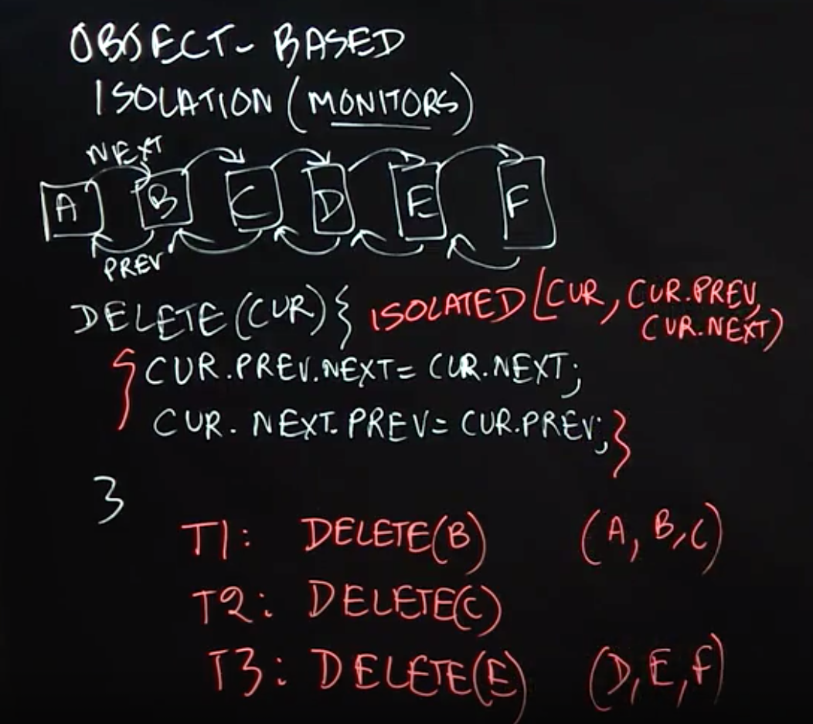
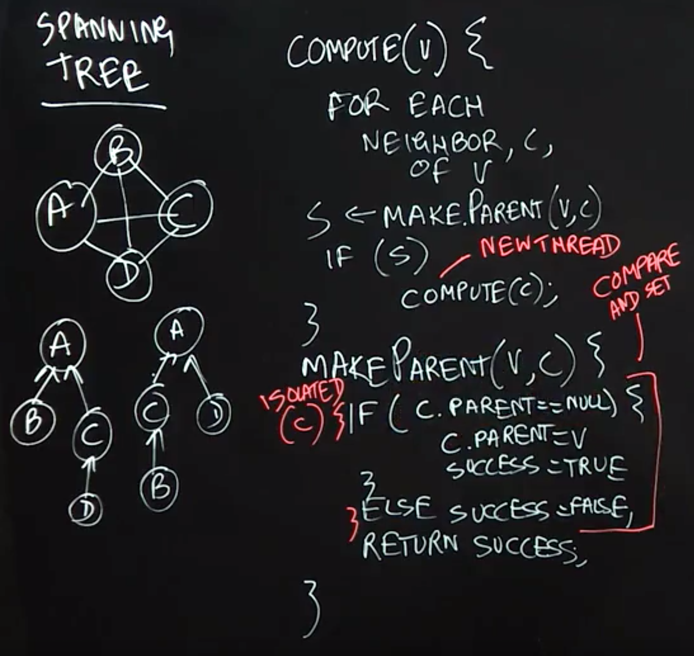
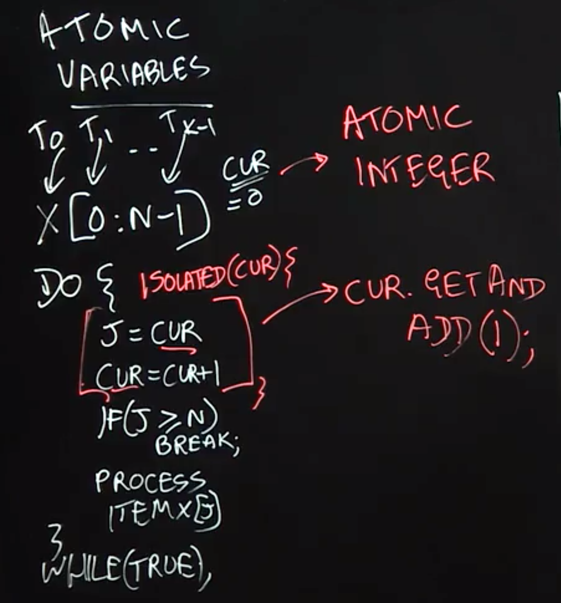

## Critical Sections

**Lecture Summary**: In this lecture, we learned how critical sections and the isolated construct can help concurrent threads manage their accesses to shared resources, at a higher level than just using locks. When programming with threads, it is well known that the following situation is defined to be a data race error — when two accesses on the same shared location can potentially execute in parallel, with least one access being a write. However, there are many cases in practice when two tasks may legitimately need to perform concurrent accesses to shared locations, as in the bank transfer example.

With critical sections, two blocks of code that are marked as isolated, say 𝙰 and 𝙱, are guaranteed to be executed in mutual exclusion with 𝙰 executing before 𝙱 or vice versa. With the use of isolated constructs, it is impossible for the bank transfer example to end up in an inconsistent state because all the reads and writes for one isolated section must complete before the start of another isolated construct. Thus, the parallel program will see the effect of one isolated section completely before another isolated section can start.

> 每个线程中访问临界资源的那段程序称为临界区（Critical Section）（临界资源是一次仅允许一个线程使用的共享资源）。每次只准许一个线程进入临界区，进入后不允许其他线程进入。不论是硬件临界资源，还是软件临界资源，多个线程必须互斥地对它进行访问。

### 线程进入临界区的调度原则

1. 如果有若干线程要求进入空闲的临界区，一次仅允许一个线程进入。
2. 任何时候，处于临界区内的线程不可多于一个。如已有线程进入自己的临界区，则其它所有试图进入临界区的线程必须等待。
3. 进入临界区的线程要在有限时间内退出，以便其它线程能及时进入自己的临界区。
4. 如果线程不能进入自己的临界区，则应让出CPU，避免线程出现“忙等”现象。如果有多个线程试图同时访问临界区，那么在有一个线程进入后其他所有试图访问此临界区的线程将被挂起，并一直持续到进入临界区的线程离开。临界区在被释放后，其他线程可以继续抢占，并以此达到用原子方式操作共享资源的目的。


## Object-Based Isolation

**Lecture Summary**: In this lecture, we studied object-based isolation, which generalizes the isolated construct and relates to the classical concept of **monitors**. The fundamental idea behind object-based isolation is that an isolated construct can be extended with a set of objects that indicate the scope of isolation, by using the following rules: if two isolated constructs have an empty intersection in their object sets they can execute in parallel, otherwise they must execute in mutual exclusion. We observed that implementing this capability can be very challenging with locks because a correct implementation must enforce the correct levels of mutual exclusion without entering into deadlock or livelock states. The linked-list example showed how the object set for a 𝚍𝚎𝚕𝚎𝚝𝚎() method can be defined as consisting of three objects — the current, previous, and next objects in the list, and that this object set is sufficient to safely enable parallelism across multiple calls to 𝚍𝚎𝚕𝚎𝚝𝚎(). The Java code sketch to achieve this object-based isolation using the PCDP library is as follows:

```Java
isolated(cur, cur.prev, cur.next, () -> {
    . . . // Body of object-based isolated construct
});
```
The relationship between object-based isolation and monitors is that all methods in a monitor object, 𝙼𝟷, are executed as object-based isolated constructs with a singleton object set, {𝙼𝟷}. Similarly, all methods in a monitor object, 𝙼𝟸, are executed as object-based isolated constructs with a singleton object set, {𝙼𝟸} which has an empty intersection with {𝙼𝟷}.




## Spanning Tree Example

**Lecture Summary**: In this lecture, we learned how to use object-based isolation to create a parallel algorithm to compute spanning trees for an undirected graph. Recall that a spanning tree specifies a subset of edges in the graph that form a tree (no cycles), and connect all vertices in the graph. A standard recursive method for creating a spanning tree is to perform a depth-first traversal of the graph (the Compute(v) function in our example), making the current vertex a parent of all its neighbors that don’t already have a parent assigned in the tree (the MakeParent(v, c) function in the example).

The approach described in this lecture to parallelize the spanning tree computation executes recursive Compute(c) method calls in parallel for all neighbors, c, of the current vertex, v. Object-based isolation helps avoid a data race in the MakeParent(v,c) method, when two parallel threads might attempt to call MakeParent(v1, c) and MakeParent(v2, c) on the same vertex c at the same time. In this example, the role of object-based isolation is to ensure that all calls to MakeParent(v,c) with the same c value must execute the object-based isolated statement in mutual exclusion, whereas calls with different values of c can proceed in parallel.




## Atomic Variables

**Lecture Summary**: In this lecture, we studied Atomic Variables, an important special case of object-based isolation which can be very efficiently implemented on modern computer systems. In the example given in the lecture, we have multiple threads processing an array, each using object-based isolation to safely increment a shared object, cur, to compute an index j which can then be used by the thread to access a thread-specific element of the array.

However, instead of using object-based isolation, we can declare the index cur to be an Atomic Integer variable and use an atomic operation called getAndAdd() to atomically read the current value of cur and increment its value by 1. Thus, 𝚓=𝚌𝚞𝚛.𝚐𝚎𝚝𝙰𝚗𝚍𝙰𝚍𝚍(𝟷) has the same semantics as 𝚒𝚜𝚘𝚕𝚊𝚝𝚎𝚍 (𝚌𝚞𝚛) { 𝚓=𝚌𝚞𝚛;𝚌𝚞𝚛=𝚌𝚞𝚛+𝟷; } but is implemented much more efficiently using hardware support on today’s machines.

Another example that we studied in the lecture concerns Atomic Reference variables, which are reference variables that can be atomically read and modified using methods such as compareAndSet(). If we have an atomic reference ref, then the call to ref.compareAndSet(expected, new) will compare the value of ref to expected, and if they are the same, set the value of ref to new and return true. This all occurs in one atomic operation that cannot be interrupted by any other methods invoked on the ref object. If ref and expected have different values, compareAndSet() will not modify anything and will simply return false.




## Read-Write Isolation

**Lecture Summary**: In this lecture we discussed Read-Write Isolation, which is a refinement of object-based isolation, and is a higher-level abstraction of the read-write locks studied earlier as part of Unstructured Locks. The main idea behind read-write isolation is to separate read accesses to shared objects from write accesses. This approach enables two threads that only read shared objects to freely execute in parallel since they are not modifying any shared objects. The need for mutual exclusion only arises when one or more threads attempt to enter an isolated section with write access to a shared object.

This approach exposes more concurrency than object-based isolation since it allows read accesses to be executed in parallel. In the doubly-linked list example from our lecture, when deleting an object cur from the list by calling delete(cur), we can replace object-based isolation on cur with read-only isolation, since deleting an object does not modify the object being deleted; only the previous and next objects in the list need to be modified.