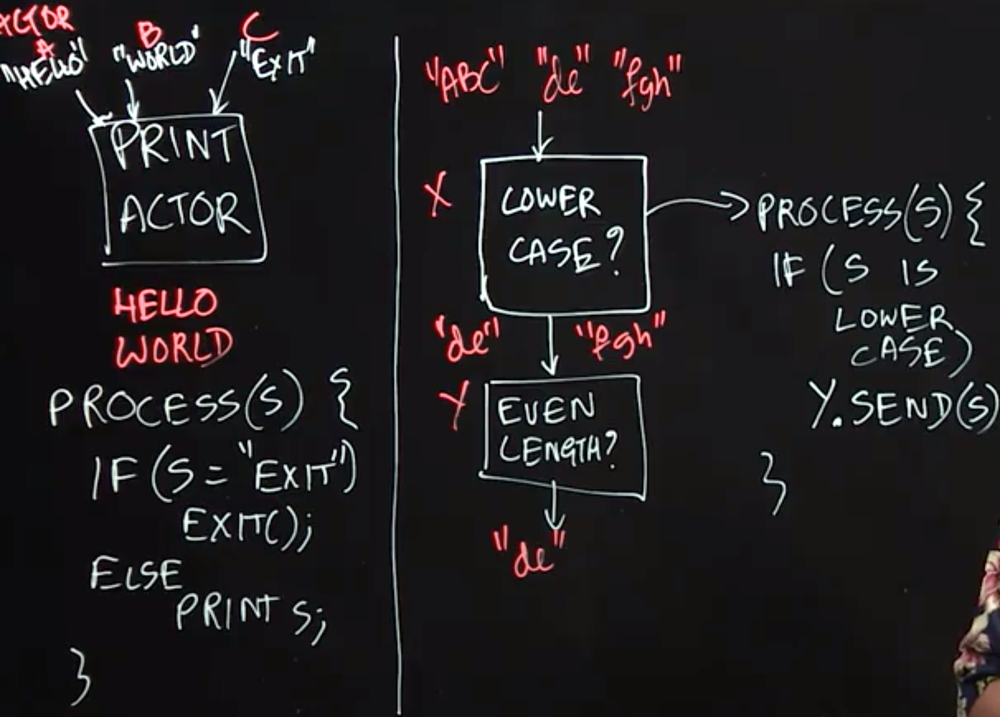
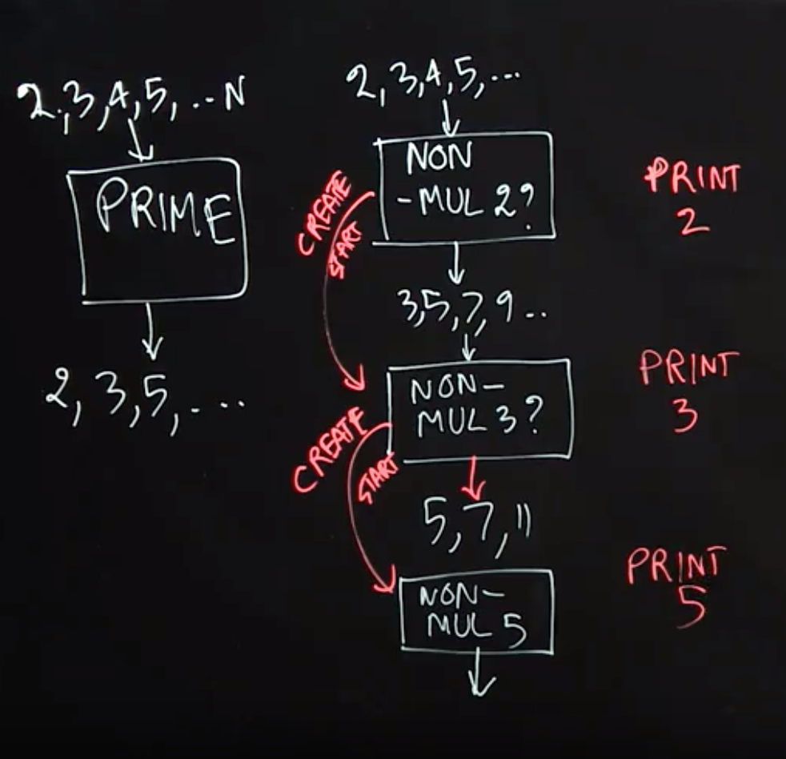
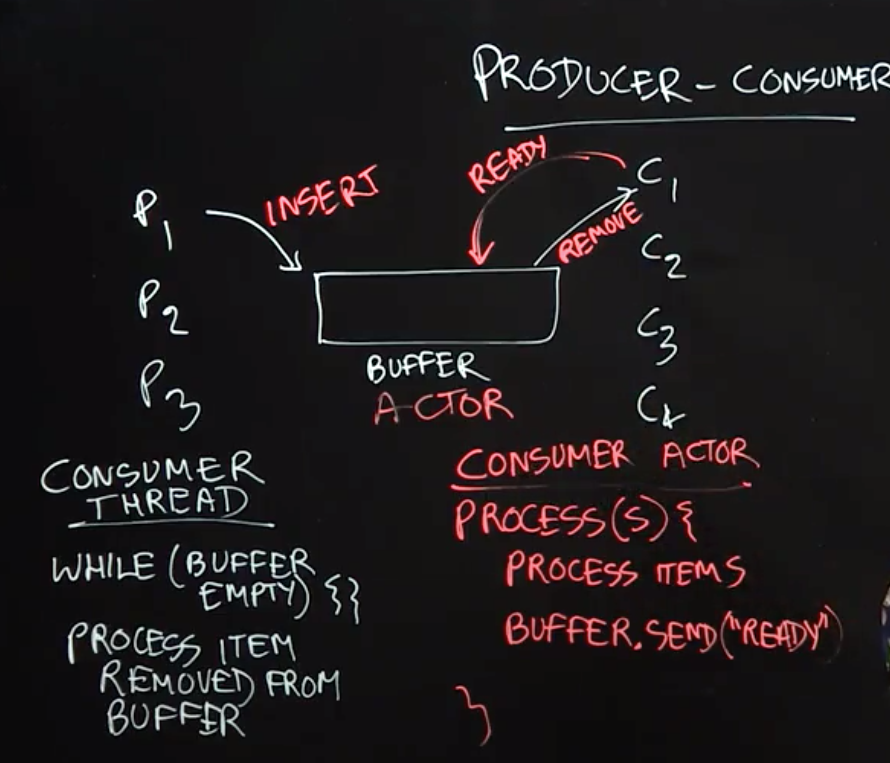
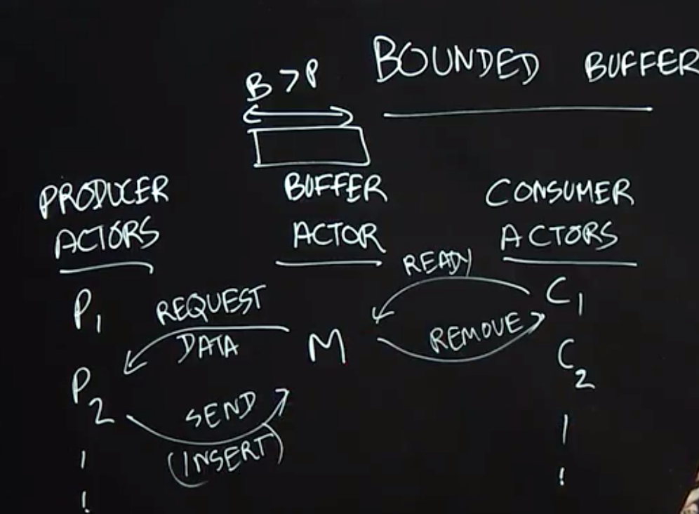

Table of Contents
=================

  * [Actor Model](#actor-model)
  * [Actor Examples](#actor-examples)
     * [Sieve of Eratosthenes(埃拉托斯特尼筛法)](#sieve-of-eratosthenes埃拉托斯特尼筛法)
  * [Producer-Consumer Problem with Unbounded Buffer](#producer-consumer-problem-with-unbounded-buffer)
  * [Producer-Consumer Problem with Bounded Buffer](#producer-consumer-problem-with-bounded-buffer)


## Actor Model

**Lecture Summary**: In this lecture, we introduced the Actor Model as an even higher level of concurrency control than locks or isolated sections. One limitation of locks, and even isolated sections, is that, while many threads might correctly control the access to a shared object (e.g., by using object-based isolation) it only takes one thread that accesses the object directly to create subtle and hard-to-discover concurrency errors. The Actor model avoids this problem by forcing all accesses to an object to be isolated by default. The object is part of the local state of an actor, and cannot be accessed directly by any other actor.

An Actor consists of a **Mailbox**, a set of **Methods**, and **Local State**. The Actor model is reactive, in that actors can only execute methods in response to messages; these methods can read/write local state and/or send messages to other actors. Thus, the only way to modify an object in a pure actor model is to send messages to the actor that owns that object as part of its local state. In general, messages sent to actors from different actors can be arbitrarily reordered in the system. However, in many actor models, messages sent between the same pair of actors preserve the order in which they are sent


## Actor Examples

**Lecture Summary**: In this lecture, we further studied the Actor Model through two simple examples of using actors to implement well-known concurrent programming patterns. The PrintActor in our first example processes simple String messages by printing them. If an 𝙴𝚇𝙸𝚃 message is sent, then the PrintActor completes its current computation and exits. As a reminder, we assume that messages sent between the same pair of actors preserve the order in which they are sent.

In the second example, we created an actor pipeline, in which one actor checks the incoming messages and only forwards the ones that are in lower case. The second actor processes the lowercase messages and only forwards the ones that are of even length. This example illustrates the power of the actor model, as this concurrent system would be much more difficult to implement using threads, for example, since much care would have to be taken on how to implement a shared mailbox for correct and efficient processing by parallel threads.


### Sieve of Eratosthenes(埃拉托斯特尼筛法)


给出要筛数值的范围n，找出$\sqrt{n}$以内的素数 p_{1},p_{2},...,p_{n}。先用2去筛，即把2留下，把2的倍数剔除掉；再用下一個質數，也就是3筛，把3留下，把3的倍数剔除掉；接下去用下一個質數5筛，把5留下，把5的倍数剔除掉；不斷重複下去。
```python
def eratosthenes(n):
    IsPrime = [True] * (n + 1)
    for i in range(2, int(n ** 0.5) + 1):
        if IsPrime[i]:
            for j in range(i * i, n + 1, i):
                IsPrime[j] = False
    return [x for x in range(2, n + 1) if IsPrime[x]]

if __name__ == "__main__":
    print(eratosthenes(120))
```


**Lecture Summary**: In this lecture, we studied how to use actors to implement a pipelined variant of the Sieve of Eratosthenes algorithm for generating prime numbers. This example illustrates the power of the Actor Model, including dynamic creation of new actors during a computation.

To implement the Sieve of Eratosthenes, we first create an actor, Non-Mul-2, that receives (positive) natural numbers as input (up to some limit), and then filters out the numbers that are multiples of 2. After receiving a number that is not a multiple of 2 (in our case, the first would be 3), the Non-Mul-2 actor creates the next actor in the pipeline, Non-Mul-3, with the goal of discarding all the numbers that are multiples of 3. The Non-Mul-2 actor then forwards all non-multiples of 2 to the Non-Mul-3 actor. Similarly, this new actor will create the next actor in the pipeline, Non-Mul-5, with the goal of discarding all the numbers that are multiples of 5. The power of the Actor Model is reflected in the dynamic nature of this problem, **where pieces of the computation (new actors) are created dynamically as needed**.

A Java code sketch for the process() method for an actor responsible for filtering out multiples of the actor's "local prime" in the Sieve of Eratosthenes is as follows:

```Java
public void process(final Object msg) {
  int candidate = (Integer) msg;
  // Check if the candidate is a non-multiple of the "local prime".
  // For example, localPrime = 2 in the Non-Mul-2 actor
  boolean nonMul = ((candidate % localPrime) != 0);
  // nothing needs to be done if nonMul = false
  if (nonMul) {
    if (nextActor == null) { 
      . . . // create & start new actor with candidate as its local prime
    }
    else nextActor.send(msg); // forward message to next actor
  } 
} // process
```




## Producer-Consumer Problem with Unbounded Buffer
**Lecture Summary**: In this lecture, we studied the producer-consumer pattern in concurrent programming which is used to solve the following classical problem: how can we safely coordinate accesses by multiple producer tasks, p1,p2,...,and multiple consumer tasks, C1,C2,C3,... to a shared buffer of unbounded size without giving up any concurrency? Part of the reason that this problem can be challenging is that we cannot assume any a priori knowledge about the rate at which different tasks produce and consume items in the buffer. While it is possible to solve this problem by using locks with wait-notify operations or by using object-based isolation, both approaches will require low-level concurrent programming techniques to ensure correctness and maximum performance. Instead, a more elegant solution can be achieved by using actors as follows.

The key idea behind any actor-based solution is to think of all objects involved in the concurrent program as actors, which in this case implies that producer tasks, consumer tasks, and the shared buffer should all be implemented as actors. The next step is to establish the communication protocols among the actors. A producer actor can simply send a message to the buffer actor whenever it has an item to produce. The protocol for consumer actors is a bit more complicated. Our solution requires a consumer actor to send a message to the buffer actor whenever it is ready to process an item. Thus, whenever the buffer actor receives a message from a producer, it knows which consumers are ready to process items and can forward the produced item to any one of them. Thus, with the actor model, all concurrent interactions involving the buffer can be encoded in messages, instead of using locks or isolated statements.



##  Producer-Consumer Problem with Bounded Buffer
**Lecture Summary**: A major simplification made in the previous lecture was to assume that the shared buffer used by producer and consumer tasks can be unbounded in size. However, in practice, it is also important to consider a more realistic version of the the producer-consumer problem in which the buffer has a bounded size. In fact, the classical producer-consumer problem statement usually assumes a bounded buffer by default. In this lecture, we studied how the actor-based solution to the unbounded buffer case can be extended to support a bounded buffer.

The main new challenge with bounding the size of the shared buffer is to ensure that producer tasks are not permitted to send items to the buffer when the buffer is full. Thus, the buffer actor needs to play a master role in the protocol by informing producer actors when they are permitted to send data. This is akin to the role played by the buffer/master actor with respect to consumer actors, even in the unbounded buffer case (in which the consumer actor informed the buffer actor when it is ready to consume an item). Now, the producer actor will only send data when requested to do so by the buffer actor. Though, this actor-based solution appears to be quite simple, it actually solves a classical problem that has been studied in advanced operating system classes for decades.


