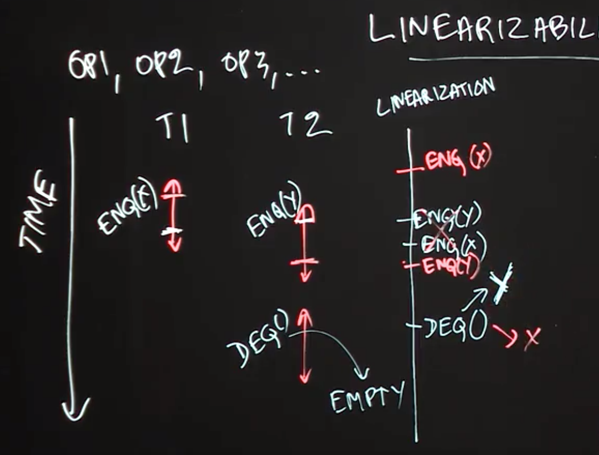

Table of Contents
=================

  * [Optimistic Concurrency](#optimistic-concurrency)
  * [Concurrent Queue](#concurrent-queue)
  * [Linearizability](#linearizability)
  * [Concurrent HashMap](#concurrent-hashmap)
  * [Concurrent Minimum Spanning Tree Algorithm](#concurrent-minimum-spanning-tree-algorithm)


## Optimistic Concurrency

**Lecture Summary**: In this lecture, we studied the optimistic concurrency pattern, which can be used to improve the performance of concurrent data structures. In practice, this pattern is most often used by experts who implement components of concurrent libraries, such as AtomicInteger and ConcurrentHashMap, but it is useful for all programmers to understand the underpinnings of this approach. As an example, we considered how the getAndAdd() method is typically implemented for a shared AtomicInteger object. The basic idea is to allow multiple threads to read the existing value of the shared object (curVal) without any synchronization, and also to compute its new value after the addition (newVal) without synchronization. These computations are performed optimistically under the assumption that **no interference will occur with other threads during the period between reading curVal and computing newVal.** However, it is necessary for each thread to confirm this assumption by using the compareAndSet() method as follows. (compareAndSet() is used as an important building block for optimistic concurrency because it is implemented very efficiently on many hardware platforms.)


The method call A.compareAndSet(curVal, newVal) invoked on AtomicInteger A checks that the value in A still equals curVal, and, if so, updates A’s value to newVal before returning true; otherwise, the method simply returns false without updating A. Further, the compareAndSet() method is guaranteed to be performed atomically, as if it was in an object-based isolated statement with respect to object A. Thus, if two threads, T1 and T2 call compareAndSet() with the same curVal that matches A’s current value, only one of them will succeed in updating A with their newVal. Furthermore, each thread will invoke an operation like compareAndSet() repeatedly in a loop until the operation succeeds. This approach is guaranteed to never result in a deadlock since there are no blocking operations. Also, since each call compareAndSet() is guaranteed to eventually succeed, there cannot be a livelock either. In general, so long as the contention on a single shared object like A is not high, the number of calls to compareAndSet() that return false will be very small, and the optimistic concurrency approach can perform much better in practice (but at the cost of more complex code logic) than using locks, isolation, or actors.


```Java
Atomic Integer{
    Get();
    Set();
    CompareAndSet();
    GetAndAdd(Delta){
        while(true){
            cur = This.Get();
            next = cur + Delta;
            if(This.compareAndSet(cur,next)){
                return cur
            }
            ......
        }
    }
}
```

## Concurrent Queue

**Lecture Summary**: In this lecture, we studied concurrent queues, an extension of the popular queue data structure to support concurrent accesses. The most common operations on a queue are enq(x), which enqueues object x at the end (tail) of the queue, and deq() which removes and returns the item at the start (head) of the queue. A correct implementation of a concurrent queue must ensure that calls to enq() and deq() maintain the correct semantics, even if the calls are invoked concurrently from different threads. While it is always possible to use locks, isolation, or actors to obtain correct but less efficient implementations of a concurrent queue, this lecture illustrated how an expert might implement a more efficient concurrent queue using the optimistic concurrency pattern.

A common approach for such an implementation is to replace an object reference like tail by an **AtomicReference**. Since the compareAndSet() method can also be invoked on AtomicReference objects, we can use it to support (for example) concurrent calls to enq() by identifying which calls to compareAndSet() succeeded, and repeating the calls that failed. This provides the basic recipe for more efficient implementations of enq() and deq(), as are typically developed by concurrency experts. A popular implementation of concurrent queues available in Java is java.util.concurent.ConcurrentLinkedQueue.


```Java
Queue{
    enqueue(x){
        tail.next = x;
        tail = x;
    }
}


ConcurrentQueue{
    enqueue(x){
        while (true){
            // if other thread set the tail.next,   tail.next != null
            if(!tail.next.compareAndSet(NULL,x))
                continue
        }
    }
}

```

## Linearizability

**Lecture Summary**: In this lecture, we studied an important correctness property of concurrent objects that is called Linearizability. A concurrent object is a data structure that is designed to support operations in parallel by multiple threads. The key question answered by linearizability is what return values are permissible when multiple threads perform these operations in parallel, taking into account what we know about the expected return values from those operations when they are performed sequentially. As an example, we considered two threads, T1 and T2 performing enq(x) and enq(y) operations in parallel on a shared concurrent queue data structure, and considered what values can be returned by a deq() operation performed by T2 after the call to enq(y). From the viewpoint of linearizability, it is possible for the deq() operation to return item x or item y.

One way to look at the definition of linearizability is as though you are a lawyer attempting to “defend” a friend who implemented a concurrent data structure, and that all you need to do to prove that your friend is “not guilty” (did not write a buggy implementation) is to show one scenario in which all the operations return values that would be consistent with a sequential execution by identifying logical moments of time at which the operations can be claimed to have taken effect. Thus, if deq() returned item x or item y you can claim that either scenario is plausible because we can reasonably assume that enq(x) took effect before enq(y), or vice versa. However, there is absolutely no plausible scenario in which the call to deq() can correctly return a code/exception to indicate that the queue is empty since at least enq(y) must have taken effect before the call to deq(). Thus, a goal for any implementation of a concurrent data structure is to ensure that all its executions are linearizable by using whatever combination of constructs (e.g., locks, isolated, actors, optimistic concurrency) is deemed appropriate to ensure correctness while giving the maximum performance.





## Concurrent HashMap

**Lecture Summary**: In this lecture, we studied the ConcurrentHashMap data structure, which is available as part of the java.util.concurrent standard library in Java. A ConcurrentHashMap instance, chm, implements the Map interface, including the get(key) and put(key, value) operations. It also implements additional operations specified in the ConcurrentMap interface (which in turn extends the Map interface); one such operation is putIfAbsent(key, value). The motivation for using putIfAbsent() is to ensure that only one instance of key is inserted in chm, even if multiple threads attempt to insert the same key in parallel. Thus, the semantics of calls to get(), put(), and putIfAbsent() can all be specified by the theory of linearizability studied earlier. However, it is worth noting that there are also some aggregate operations, such as clear() and putAll(), that cannot safely be performed in parallel with put(), get() and putIfAbsent().

Motivated by the large number of concurrent data structures available in the java.util.concurrent library, this lecture advocates that, when possible, you use libraries such as ConcurrentHashMap rather than try to implement your own version.


## Concurrent Minimum Spanning Tree Algorithm

**Lecture Summary**: In this lecture, we discussed how to apply concepts learned in this course to design a concurrent algorithm that solves the problem of finding a minimum-cost spanning tree (MST) for an undirected graph. It is well known that undirected graphs can be used to represent all kinds of networks, including roadways, train routes, and air routes. A spanning tree is a data structure that contains a subset of edges from the graph which connect all nodes in the graph without including a cycle. The cost of a spanning tree is computed as the sum of the weights of all edges in the tree.

The concurrent algorithm studied in this lecture builds on a well-known sequential algorithm that iteratively performs edge contraction operations, such that given a node N1 in the graph, GetMinEdge(N1) returns an edge adjacent to N1 with minimum cost for inclusion in the MST. If the minimum-cost edge is (N1,N2), the algorithm will attempt to combine nodes N1 and N2 in the graph and replace the pair by a single node, N3. To perform edge contractions in parallel, we have to look out for the case when two threads may collide on the same vertex. For example, even if two threads started with vertices A and D, they may both end up with C as the neighbor with the minimum cost edge. We must avoid a situation in which the algorithm tries to combine both A and C and D and C. One possible approach is to use unstructured locks with calls to tryLock() to perform the combining safely, but without creating the possibility of deadlock or livelock situations. A key challenge with calling tryLock() is that some fix-up is required if the call returns false. Finally, it also helps to use a concurrent queue data structure to keep track of nodes that are available for processing.

