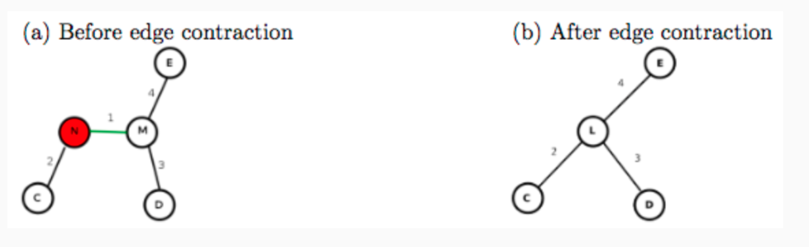

## Project Goals and Outcome

In this assignment, we will focus on parallelizing a reference sequential version of Boruvka's algorithm. The following summary of Boruvka's sequential algorithm is from the Galois project's description of Boruvka's algorithm:

"Boruvka's algorithm computes the minimal spanning tree through successive applications of edge-contraction on an input graph (without self-loops). In edge-contraction, an edge is chosen from the graph and a new node is formed with the union of the connectivity of the incident nodes of the chosen edge. In the case that there are duplicate edges, only the one with least weight is carried through in the union. Figure 2 demonstrates this process. Boruvka's algorithm proceeds in an unordered fashion. Each node performs edge contraction with its lightest neighbor."

In the example below, the edge connecting nodes M and N is contracted, resulting in the replacement of nodes M and N by a single node, L.

n this assignment, we'll explore the use of concurrent queues, threads, and unstructured locks, with calls to tryLock(), to produce a concurrent and data race-free implementation of Boruvka's algorithm. Your parallel implementation will be evaluated on real datasets representing the road networks of several United States regions. These datasets are pre-packaged with the miniproject_4.zip above.

## Project Setup

Please refer to Mini-Project 0 for a description of the build and testing process used in this course.

Once you have downloaded and unzipped the project files using the gray button labeled miniproject_4.zip at the top of this description, you should see the project source code file at

miniproject_4/src/main/java/edu/coursera/concurrent/ParBoruvka.java

and the project tests in

miniproject_4/src/test/java/edu/coursera/concurrent/BoruvkaPerformanceTest.java

It is recommended that you review the demo video and lecture videos for this week before starting this assignment. An example sequential implementation is also provided in SeqBoruvka.java.

## Project Instructions

Your modifications should be made entirely inside of ParBoruvka.java. You should not change the signatures of any public or protected methods inside of ParBoruvka.java, but you can edit the method bodies and add any new methods that you choose. We will use our copy of BoruvkaPerformanceTest.java in the final grading process, so do not change that file or any other file except ParBoruvka.java.

Your main goal for this assignment is to complete the computeBoruvka method at the top of ParBoruvka. The testing infrastructure will call computeBoruvka from a certain number of Java threads. You do not need to create any additional threads if you do not wish to (indeed, it is recommended that you do not). computeBoruvka is passed two objects:

nodesLoaded: A ConcurrentLinkedQueue object containing a list of all nodes in the input graph for which you are to compute a minimum spanning tree using Boruvka's algorithm. Because this Queue<ParComponent> object is a ConcurrentLinkedQueue, it is safe to access nodesLoaded from multiple threads concurrently without additional synchronization.
solution: A BoruvkaSolution object on which you will call BoruvkaSolution.setSolution once your parallel Boruvka implementation has collapsed the input graph down to a single component. You must only call setSolution once, and the testing infrastructure will use the provided result to verify your output.
Inside of ParBoruvka, there are two additional inner classes: ParComponent and ParEdge. ParComponent represents a single component in the graph. A component may be a singleton node, or it may be formed from collapsing multiple nodes into each other. A ParEdge represents an edge between two ParComponents. You may not change the signatures for the existing methods in ParComponent or ParEdge. However, you are free to modify their method bodies, to add new methods, or to add new fields. An efficient implementation will likely require modifications to ParComponent and/or ParEdge.

## Project Evaluation

Your assignment submission should consist of only the ParBoruvka.java file that you modified to implement this mini-project. As before, you can upload this file through the assignment page for this mini-project. After that, the Coursera autograder will take over and assess your submission, which includes building your code and running it on one or more tests. Your submission will be evaluated on Coursera’s auto-grading system using 4 CPU cores. Note that the performance observed for tests on your local machine may differ from that on Coursera's auto-grading system, but that you will only be evaluated on the measured performance on Coursera. Also note that for all assignments in this course you are free to resubmit as many times as you like. See the Common Pitfalls page under Resources for more details. Please give it a few minutes to complete the grading. Once it has completed, you should see a score appear in the “Score” column of the “My submission” tab based on the following rubric:

- 50% - Performance on 4 cores while processing the FLA dataset
- 50% - Performance on 4 cores while processing the NE dataset

NOTE: Unlike past mini-projects, this mini-project loads datasets from files. If during your local testing you encounter java.io.FileNotFoundException errors, modify the paths to USA-road-d.FLA.gr.gz and USA-road-d.NE.gr.gz at the top of BoruvkaPerformanceTest.java to be the absolute paths on your local machine to the respective files. These files are provided with the mini-project ZIP, under src/main/resources/boruvka. This will not affect grading on the Coursera auto-grader.